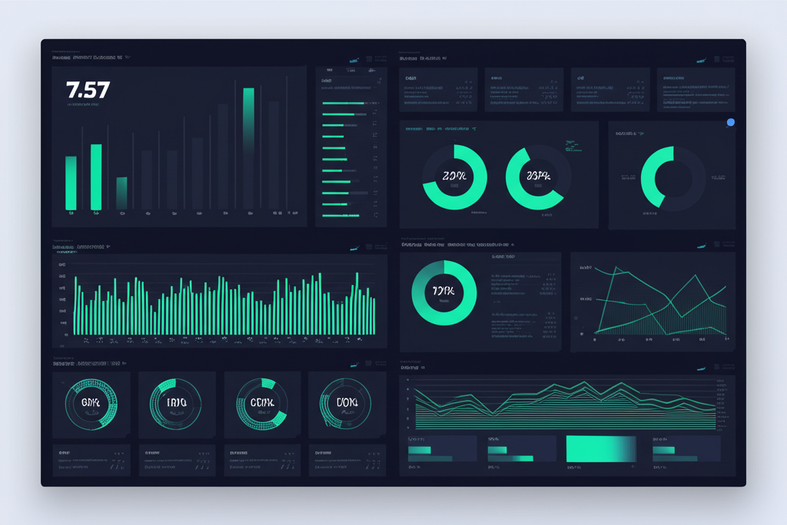
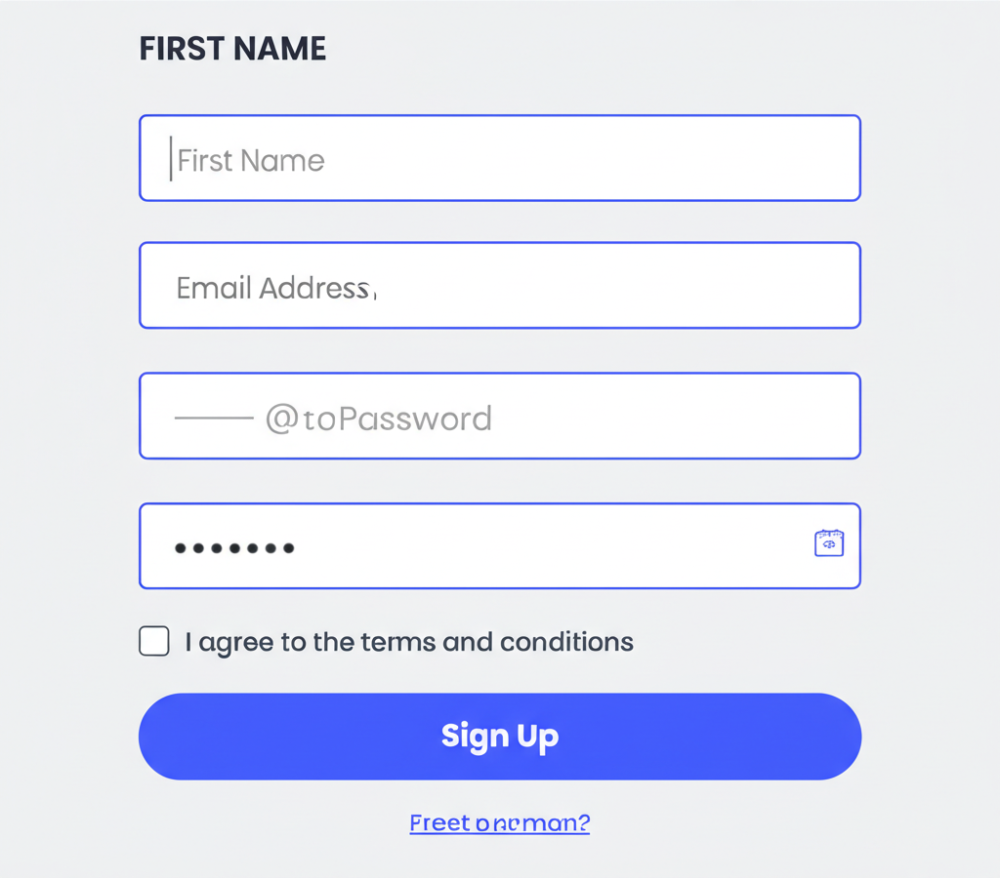

# 低代码平台 [](https://github.com/your-org/low-code-platform/actions)

## 项目简介

本项目是一个基于 Next.js 和 React 的低代码平台，支持可视化页面搭建、组件拖拽、属性配置、主题编辑、模板库、表单生成、动画编辑、多人协作等功能，适用于快速构建 Web 应用。

- **官网**: [https://lowcode.example.com](https://lowcode.example.com)
- **特点**:
  - 可视化低代码搭建平台，拖拽即可生成页面
  - 丰富的组件库，覆盖常见业务场景
  - 支持自定义组件开发与扩展
  - 实时预览与代码导出功能
  - 多主题支持与样式定制
  - 协作编辑与版本管理

## 主要功能

- 可视化页面搭建与实时预览
- 丰富的组件库与模板库（包含 50+ UI 组件）
- 组件属性、样式、动画可配置
- 表单可视化生成与数据管理
- 多人协作与实时同步
- 主题与响应式适配
- 代码导出与集成

### 核心组件

- **编辑器组件**：Canvas、PreviewCanvas、AnimationEditor、ThemeEditor
- **UI 组件库**：Button、Input、Form、Table、Chart 等 50+组件
- **模板系统**：Dashboard、Landing Page、Form 等模板
- **工具组件**：Collaboration、CodeExport、ComponentTree 等

## 技术架构

- 前端：Next.js、React、TypeScript、Tailwind CSS、Radix UI
- 后端：Next.js API 路由（可扩展为 Node.js 服务）
- 数据库：可选 PostgreSQL/MongoDB 等
- 对象存储：OSS/S3 等
- 认证：支持 OAuth/自建认证服务

## 开发环境

- Node.js 18+
- pnpm 8+
- TypeScript 5+

## 快速启动

```bash
pnpm install
pnpm dev
```

访问 http://localhost:3000 体验低代码平台。

## 项目截图




## 目录结构

```
├── app/                # Next.js应用入口与页面路由
│   ├── layout.tsx      # 全局布局
│   └── page.tsx        # 主页面
├── components/         # 功能组件
│   ├── core/           # 核心编辑器组件
│   ├── templates/      # 页面模板
│   ├── charts/         # 图表组件
│   └── ui/             # 基础UI组件库
├── docs/               # 文档
│   ├── architecture/   # 架构设计文档
│   └── qa/             # 常见问题解答
├── hooks/              # 自定义React Hooks
├── lib/                # 工具函数与类型定义
├── public/             # 静态资源文件
└── styles/             # 全局样式配置
```

## C4 模型

项目已按 C4 模型分层建模，详见 `c4model/` 文件夹，包含系统上下文、容器、组件、部署等架构图（puml 格式）。

---

如需二次开发或部署，请参考下方产品与技术文档：

- [用户手册](docs/用户手册.md)
- [产品说明](docs/产品说明.md)
- [技术文档](docs/技术文档.md)
- [术语表](docs/术语表.md)
- [低代码核心原理](docs/低代码核心原理.md)
- [C4 架构模型文档](docs/architecture/)

## 贡献指南

欢迎提交 Pull Request 或 Issue。提交代码前请确保：

1. 通过 ESLint 检查
2. 添加必要的单元测试
3. 更新相关文档

## 许可证

MIT © 2025 低代码平台团队

如有问题或建议，欢迎提交 issue 或联系开发团队。
