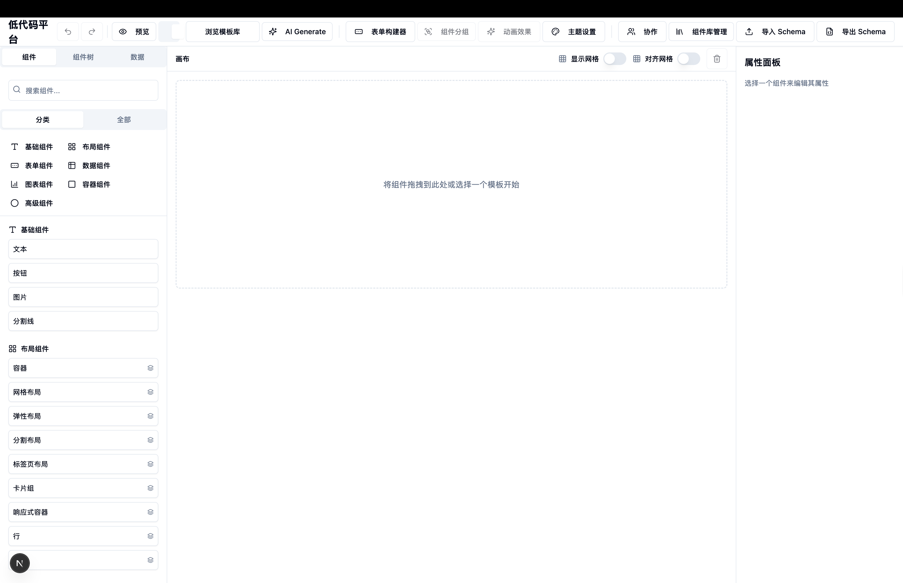

# Low-Code Platform

A visual low-code development platform built with Next.js and React, supporting drag-and-drop page building, component management, theme customization, and code export.

## ✨ Features

- **🎨 Visual Editing**: Drag-and-drop canvas, real-time preview, component tree view, property panel
- **🧩 Component System**: Built-in component library based on Radix UI, supports custom components and component import/export
- **🤖 AI Generation**: Generate components and pages through natural language; supports cloud providers (OpenAI, Claude, DeepSeek, etc.) and **local LLM via Ollama** (no API key required)
- **📊 Data & Charts**: Data binding tools, chart components (Recharts), form builder (React Hook Form + Zod)
- **🎭 Themes & Animations**: Theme editor, animation editor, responsive design, dark mode
- **🌐 Internationalization**: Multi-language support (Chinese/English), language switcher component, localization tools
- **🤝 Real-time Collaboration**: WebSocket real-time synchronization, conflict resolution, collaborative cursors, history merging
- **☁️ Cloud Service Integration**: AWS integration (S3, Lambda, API Gateway, etc.), one-click deployment
- **⚡ Performance Optimization**: Performance toolset, optimized data parsing and Schema processing

## 📸 Screenshots

### Editor

<p align="center">
  
</p>

## 🛠 Tech Stack

**Frontend**: Next.js 15 + React 19 + TypeScript + **Emotion** (`@emotion/react` / `@emotion/styled`) + Radix UI + React DnD + Recharts + Zustand

**Backend**: Python + FastAPI (`apps/server`)

**Monorepo**: pnpm 10 workspaces + Vitest/Jest + ESLint/Prettier

## 📦 Project Structure

```text
low-code-platform/
├── apps/
│   ├── web/          # Next.js frontend application (Clean Architecture)
│   │   └── src/lib/  # Internal libraries (ai-generator)
│   └── server/       # FastAPI backend application
└── packages/         # Shared packages for data structures
    ├── schema/       # Schema types and validation
    ├── component-utils/ # Component tree utilities
    └── utils/        # General utility functions
```

> **Note**: `packages/` contains shared data structures used by both frontend and backend. `apps/web/src/lib/` contains application-specific code (ai-generator).

## 🚀 Quick Start

### Requirements

- Node.js >= 18.0.0
- pnpm >= 10.0.0

### Installation & Running

```bash
# Install dependencies
pnpm install

# Start development server
pnpm dev              # Start both frontend and backend
pnpm dev:web          # Frontend only (http://localhost:3000)
pnpm dev:server       # Backend only (http://localhost:8000)

# Build for production
pnpm build

# Run tests
pnpm test             # Frontend tests
pnpm test:server       # Backend tests
```

### Environment Variables

Create a `.env.local` file (optional):

```env
# AI Services
OPENAI_API_KEY=your_key
ANTHROPIC_API_KEY=your_key
DEEPSEEK_API_KEY=your_key

# AWS
AWS_ACCESS_KEY_ID=your_key
AWS_SECRET_ACCESS_KEY=your_key
AWS_REGION=us-east-1
```

### Local LLM (Ollama)

To generate pages with a **local model** (no API key):

1. Install [Ollama](https://ollama.com) and run `ollama serve`
2. Pull a model: `ollama pull codellama`
3. In the editor, open **AI Generate** → choose **Ollama (Local)** → leave API Key empty → enter a description and generate

See [docs/en/local-llm-setup.md](docs/en/local-llm-setup.md) (English) or [docs/zh/local-llm-setup.md](docs/zh/local-llm-setup.md) (中文) for setup and troubleshooting.

## 🎯 Usage Guide

1. **Add Components**: Drag components from the left component panel to the canvas
2. **Configure Properties**: Modify component properties in the right property panel
3. **Use Templates**: Select pre-built templates from the template library to get started quickly
4. **AI Generation**: Generate components or pages through natural language descriptions (cloud or local Ollama)
5. **Export Code**: Convert designs into deployable frontend code

## 🔧 Development

### Architecture

Adopts **Clean Architecture** design:

- **Domain Layer**: Core business logic
- **Application Layer**: Application use cases and business processes
- **Infrastructure Layer**: Technical implementations (repositories, adapters, etc.)
- **Presentation Layer**: UI components and user interactions

### Shared Packages (`packages/`)

Packages for data structures shared between frontend and backend:

- `@lowcode-platform/schema` - Schema types and validation (Component, PageSchema, etc.)
- `@lowcode-platform/component-utils` - Component tree manipulation utilities
- `@lowcode-platform/utils` - General utility functions

### Internal Libraries (`apps/web/src/lib/`)

Application-specific code:

- `ai-generator/` - AI-powered component and page generation

## 📝 Todo

**In Progress**: Improve backend API, add more chart types, add page templates

**Planned**: Database connections, mobile component library, custom CSS, project management and version control

## 🤝 Contributing

Issues and Pull Requests are welcome.

1. Fork the project
2. Create a feature branch (`git checkout -b feature/AmazingFeature`)
3. Commit your changes (`git commit -m 'feat: Add some AmazingFeature'`)
4. Push to the branch (`git push origin feature/AmazingFeature`)
5. Create a Pull Request

**Code Standards**: TypeScript + ESLint/Prettier + Unit tests + Clean Architecture principles

**Commit Standards**: Follow [Conventional Commits](https://www.conventionalcommits.org/)

## 📄 License

[MIT License](LICENSE)

## 🔗 Related Links

- [Next.js](https://nextjs.org/docs) | [React](https://react.dev) | [FastAPI](https://fastapi.tiangolo.com/)
- [Emotion](https://emotion.sh/docs/introduction) | [Radix UI](https://www.radix-ui.com)
- [Architecture (中文)](docs/zh/platform-architecture.md) | [Architecture (English)](docs/en/architecture.md) | [Local LLM (English)](docs/en/local-llm-setup.md) | [本地 LLM (中文)](docs/zh/local-llm-setup.md)
