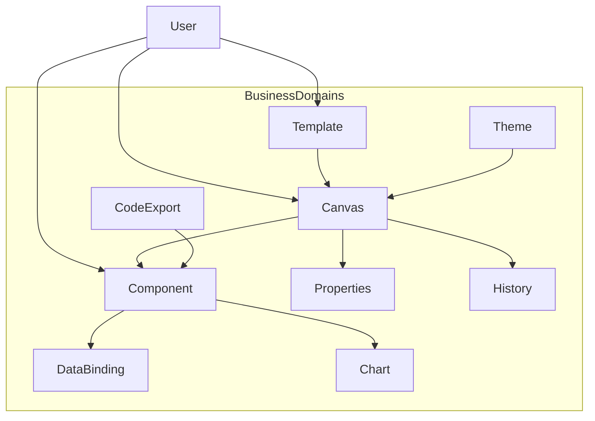

# Glossary | 领域术语表

> Low-Code Platform — Ubiquitous Language（统一语言）

---

## 1. Purpose | 文档说明

This document defines the project **Ubiquitous Language**. English terms are the **preferred canonical names** and must align with code and architecture naming. Chinese labels are for localization and stakeholder communication only.

### Maintenance Principles

1. **Glossary first**: Add or update terms here before implementing code
2. **Code sync**: Domain model changes (entity, value object, enum) must update the corresponding glossary entry
3. **Preferred term**: Use the **Preferred Term (English)** column for code, commits, and technical docs

### Reference Rules

| Scenario | Rule |
| -------- | ---- |
| TypeScript / commits | Use Preferred Term (English) |
| Jira / user stories | English preferred; Chinese may appear in parentheses for clarity |
| UI copy | Map English preferred terms to localized UI copy |
| Cross-team communication | Lead with English; add Chinese when needed |

---

## 2. Business Domains | 业务域总览

| Preferred Term | 中文 | Code Path | UI Area | Notes |
| -------------- | ---- | --------- | ------- | ----- |
| Canvas | 画布 | `src/canvas/` | Center editor | Drag-drop layout, preview, component tree, properties panel |
| Component | 组件 | `src/component/` | Left panel + canvas nodes | Types, factory, management, panel / renderer |
| Properties | 属性配置 | `src/canvas/properties-panel.tsx` | Right panel | Style / data / interaction props (owned by Canvas) |
| Template | 模板 | `src/template/` | Template gallery | Prefabricated page layouts |
| Theme | 主题 | `src/theme/` | Theme editor | Colors, typography, CSS variables |
| Animation | 动画 | `src/theme/animation-editor.tsx` | Animation editor | Motion presets (owned by Theme) |
| Data Binding | 数据绑定 | `src/data/data-binding.service.ts` | Data panel | Bind components to data sources |
| Data Source | 数据源 | `src/data/data-source.service.ts` | Data panel | Fetch / cache / refresh |
| Form Builder | 表单构建 | `src/form/` | Form builder | React Hook Form + Zod |
| Chart | 图表 | `src/chart/` | Canvas charts | Recharts-based visualizations |
| Code Export | 代码导出 | `src/export/` | Export dialog | Generate deployable frontend code |
| History | 历史记录 | `src/lib/history.store.ts`, `src/lib/history.ts` | Undo/redo | Operation history |
| Persistence | 持久化 | `src/lib/persistence.manager.ts` | LocalStorage | Browser-local project state |
| Collaboration | 协作 | `src/collaboration/` | Collaboration UI | Planned / partial real-time sync |
| Shared UI | 共享 UI | `src/components/` | — | UI kit + shell chrome |
| Shared hooks | 共享 hooks | `src/hooks/` | — | Cross-domain hooks |
| Shared lib | 共享工具 | `src/lib/` | — | utils, persistence, history |

**Architecture (canonical): business-domain folders + colocation**

| Area | Path | Responsibility |
| ---- | ---- | -------------- |
| Business domains | `src/{domain}/` | UI, stores, hooks, helpers colocated (no CA layer dirs) |
| Components | `src/components/` | Shared reusable UI |
| Hooks | `src/hooks/` | Shared hooks |
| Lib | `src/lib/` | Shared non-UI helpers |

---

## 3. Core Terms | 核心术语

| Preferred Term | 中文 | Definition | Code Anchors |
| -------------- | ---- | ---------- | ------------ |
| Component Instance | 组件实例 | A placed node on the canvas with type, props, and position | `src/component/types.ts` |
| Component Factory | 组件工厂 | Creates component instances with defaults by type | `src/component/component-factory.service.ts` |
| Component Management | 组件管理 | CRUD / move / select operations over instances | `src/component/component-management.service.ts` |
| Component Panel | 组件面板 | Palette of draggable component types | `src/component/component-panel.tsx` |
| Component Tree | 组件树 | Hierarchical view of canvas instances | `src/canvas/component-tree.tsx` |
| Component Renderer | 组件渲染器 | Recursively renders layout / data / chart / form nodes | `src/component/component-renderer/` |
| Preview Canvas | 预览画布 | Read-only rendering of the designed page | `src/canvas/preview-canvas.tsx` |
| Device Preview | 设备预览 | Responsive viewport simulation (desktop/tablet/mobile) | `src/canvas/canvas.store.ts` |
| Custom Component | 自定义组件 | User-defined reusable component definition | `src/component/custom-components.store.ts` |
| Template Gallery | 模板库 | Browse and apply page templates | `src/template/template-gallery.tsx` |
| Theme Config | 主题配置 | Token set for colors, fonts, radii | `src/theme/types.ts` / `theme.store.ts` |
| Undo / Redo | 撤销 / 重做 | Walk history stack of canvas mutations | `history.store` |
| Local Persistence | 本地持久化 | Save/load editor state in LocalStorage | `persistence.manager.ts` |

---

## 4. Terms to Avoid | 避免使用的说法

| Avoid | Prefer | Reason |
| ----- | ------ | ------ |
| Page Builder (as domain name) | Canvas + Component | Align with package/UI naming |
| Widget (ambiguous) | Component Instance | Prefer explicit instance term |
| Store (alone) | named store (`ComponentStore`, …) | Disambiguate Zustand modules |
| Backend / API (for core editor) | Local Persistence | Editor is client-side; no first-party REST API today |

---

## 5. Related Living Docs | 关联文档

| Document | Path |
| -------- | ---- |
| Quick Start | [developer/QUICKSTART.md](./developer/QUICKSTART.md) |
| C4 Model | [developer/c4-model/README.md](./developer/c4-model/README.md) |
| User Story Map | [product-owner/User-Story-Map.md](./product-owner/User-Story-Map.md) |
