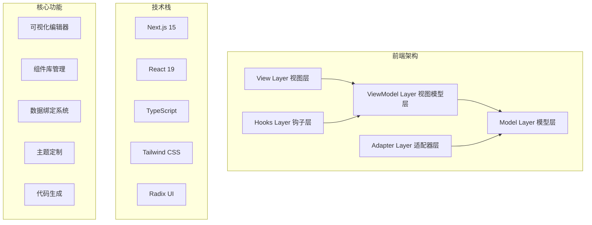

# Felix 低代码平台 - 技术文档

欢迎来到 Felix 低代码平台的技术文档中心。这里包含了平台的完整技术文档，帮助开发者理解和扩展平台功能。

## 📚 文档目录

### 🚀 快速开始
- **[快速开始指南](./project/getting-started.md)** - 从安装到创建第一个应用的完整指南
- **[用户使用手册](./project/user-guide.md)** - 详细的功能使用说明和操作指南
- **[常见问题解答](./project/faq.md)** - 常见问题的解决方案和故障排除

### 🏗️ 系统架构
- **[系统架构文档](./architecture/architecture.md)** - 详细介绍平台的 MVVM 架构设计、模块划分和数据流
- **[系统设计文档](./architecture/system-design.md)** - UML 图表、类图、时序图等系统设计详情

### 🧩 组件系统
- **[组件系统文档](./deployment/component-system.md)** - 组件架构、注册机制、属性系统和自定义组件开发

### 📊 数据管理
- **[数据流设计](./workflows/data-flow.md)** - 数据流架构、状态管理、数据绑定和事件系统

### 🚀 部署运维
- **[部署指南](./deployment/deployment.md)** - 开发、测试和生产环境的部署方案

### 👨‍💻 开发指南
- **[API 参考文档](./develop/api-reference.md)** - 完整的 API 接口文档和使用示例
- **[贡献指南](./develop/contributing.md)** - 如何参与项目开发和贡献代码
- **[测试指南](./develop/testing-guide.md)** - 测试策略、编写规范和最佳实践

### 🔄 工作流程
- **[开发工作流程](./workflows/development-workflow.md)** - 完整的开发流程和团队协作规范

### 📋 项目信息
- **[更新日志](./CHANGELOG.md)** - 版本更新记录和功能变更
- **[升级指南](./UPGRADE.md)** - 版本升级指导和迁移说明

## 🏗️ 系统架构概览

Felix 低代码平台采用现代化的 MVVM 架构，具有以下特点：



## 🧩 核心模块

### 1. 视图层 (View Layer)
- **LowCodePlatformView**: 主视图组件
- **ComponentPanel**: 组件面板
- **Canvas**: 画布区域
- **PropertiesPanel**: 属性编辑面板
- **DataPanel**: 数据管理面板

### 2. 视图模型层 (ViewModel Layer)
- **PlatformViewModel**: 平台状态管理
- **ComponentViewModel**: 组件状态管理
- **HistoryViewModel**: 历史记录管理

### 3. 模型层 (Model Layer)
- **PlatformModel**: 平台数据模型
- **ComponentModel**: 组件数据模型
- **ThemeModel**: 主题配置模型

## 🔧 开发指南

### 快速开始

1. **环境准备**
   ```bash
   node --version  # >= 18.0.0
   pnpm --version  # >= 8.0.0
   ```

2. **安装依赖**
   ```bash
   pnpm install
   ```

3. **启动开发服务器**
   ```bash
   pnpm dev
   ```

### 项目结构

```
src/
├── app/                    # Next.js App Router
├── mvvm/                   # MVVM 架构核心
│   ├── models/            # 数据模型层
│   │   ├── ComponentModel.ts
│   │   ├── PlatformModel.ts
│   │   └── types.ts
│   ├── viewmodels/        # 视图模型层
│   │   ├── ComponentViewModel.ts
│   │   ├── PlatformViewModel.ts
│   │   └── HistoryViewModel.ts
│   ├── views/             # 视图层
│   │   ├── components/    # UI 组件
│   │   └── LowCodePlatformView.tsx
│   ├── hooks/             # React Hooks
│   │   ├── usePlatformViewModel.ts
│   │   └── useComponentViewModel.ts
│   └── adapters/          # 适配器层
│       └── LegacyAdapter.ts
```

## 🎯 核心特性

### 可视化编辑器
- 拖拽式组件编辑
- 实时预览功能
- 多设备响应式预览
- 撤销/重做操作

### 组件系统
- 丰富的内置组件库
- 自定义组件支持
- 组件属性可视化编辑
- 组件分组和层级管理

### 数据绑定
- 多种数据源支持（静态、API、数据库）
- 可视化数据字段映射
- 实时数据更新
- 数据转换和过滤

### 主题定制
- 可视化主题编辑器
- 实时主题预览
- 自定义 CSS 变量
- 响应式断点配置

### 代码生成
- 生成标准 React 组件
- 支持 TypeScript
- 完整项目结构导出
- 可部署的代码包

## 🔌 扩展开发

### 自定义组件开发

```typescript
import { ComponentDefinition } from '@/mvvm/models/types';

const customComponent: ComponentDefinition = {
  id: 'my-component',
  name: 'MyComponent',
  type: 'my-component',
  category: 'custom',
  displayName: '我的组件',
  description: '自定义组件示例',
  icon: <MyIcon />,
  isContainer: false,
  defaultProps: {
    text: 'Hello World',
  },
  propSchema: {
    text: {
      type: 'string',
      label: '文本内容',
      required: true,
    },
  },
  render: (props) => <div>{props.text}</div>,
};
```

### 数据源扩展

```typescript
import { DataSource } from '@/mvvm/models/types';

const customDataSource: DataSource = {
  id: 'my-api',
  name: '自定义API',
  type: 'api',
  config: {
    url: 'https://api.example.com/data',
    method: 'GET',
    transformer: 'customTransformer',
  },
};
```

## 🧪 测试

### 运行测试

```bash
# 单元测试
pnpm test

# 测试覆盖率
pnpm test:coverage

# 测试 UI
pnpm test:ui
```

### 测试结构

```
test/
├── mvvm/                  # MVVM 模块测试
│   ├── models/           # 模型测试
│   ├── viewmodels/       # 视图模型测试
│   └── views/            # 视图测试
└── setup.ts              # 测试配置
```

## 📊 性能监控

### 关键指标

- **首屏加载时间** (FCP): < 1.5s
- **最大内容绘制** (LCP): < 2.5s
- **累积布局偏移** (CLS): < 0.1
- **首次输入延迟** (FID): < 100ms

### 性能优化

- 组件懒加载
- 虚拟化渲染
- 代码分割
- 图片优化
- 缓存策略

## 🔒 安全考虑

### 安全措施

- XSS 防护
- CSRF 保护
- 输入验证和清理
- 权限控制
- 安全的代码生成

### 最佳实践

- 定期安全审计
- 依赖漏洞扫描
- 安全编码规范
- 数据加密传输

## 🚀 部署方案

### 支持的部署平台

- **Vercel** (推荐) - 零配置部署
- **Docker** - 容器化部署
- **传统服务器** - 自托管部署
- **云平台** - AWS、Azure、GCP

### 部署流程

1. 构建生产版本
2. 配置环境变量
3. 部署到目标平台
4. 配置域名和 HTTPS
5. 监控和日志配置

## 📈 路线图

### 近期计划 (v0.2.0)

- [ ] 增强的动画编辑器
- [ ] 更多内置组件
- [ ] 插件系统
- [ ] 多语言支持

### 中期计划 (v0.3.0)

- [ ] 实时协作功能
- [ ] 版本控制系统
- [ ] 高级数据可视化
- [ ] 移动端编辑器

### 长期计划 (v1.0.0)

- [ ] 企业级权限管理
- [ ] 微服务架构
- [ ] AI 辅助设计
- [ ] 云端部署服务

## 🤝 贡献指南

### 开发流程

1. Fork 项目仓库
2. 创建功能分支
3. 编写代码和测试
4. 提交 Pull Request
5. 代码审查和合并

### 代码规范

- 使用 TypeScript 进行类型检查
- 遵循 ESLint 配置
- 编写单元测试
- 保持代码注释完整

## 📞 支持和反馈

### 获取帮助

- **文档问题**: 查看相关文档章节
- **Bug 报告**: 提交 GitHub Issue
- **功能请求**: 创建 Feature Request
- **技术讨论**: 参与 GitHub Discussions

### 联系方式

- **邮箱**: [your-email@example.com]
- **GitHub**: [项目仓库地址]
- **社区**: [讨论群链接]

---

📝 **文档更新**: 本文档会随着项目发展持续更新，请关注最新版本。

⭐ **如果这个项目对你有帮助，请给我们一个 Star！**