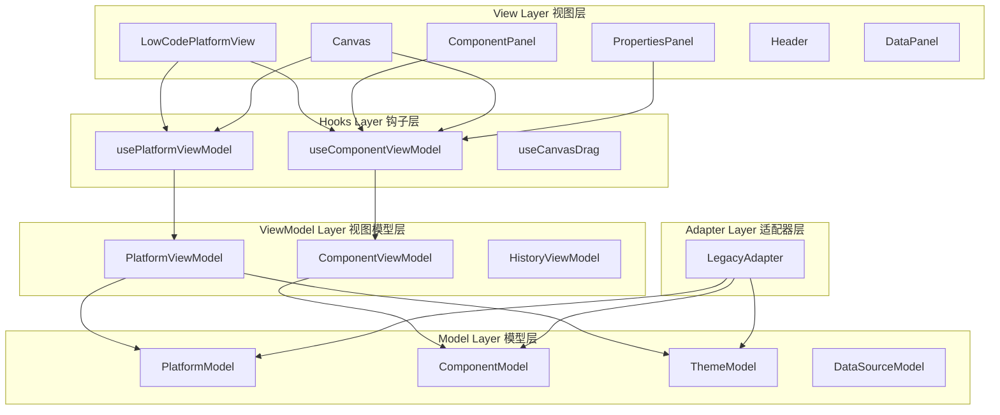
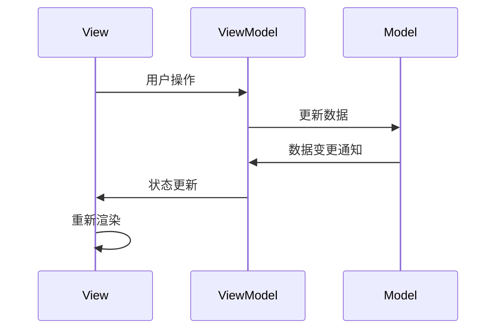

# 系统架构文档

## 概述

Felix 低代码平台采用 MVVM (Model-View-ViewModel) 架构模式，结合 React 的组件化思想，构建了一个可扩展、可维护的低代码开发平台。

## 架构设计原则

### 1. 分层架构
- **Model 层**: 负责数据模型定义和业务逻辑
- **ViewModel 层**: 处理视图状态管理和用户交互逻辑
- **View 层**: 负责 UI 渲染和用户界面展示

### 2. 单一职责
每个模块都有明确的职责边界，降低耦合度，提高代码可维护性。

### 3. 依赖注入
通过 React Hooks 实现依赖注入，便于测试和模块替换。

### 4. 数据驱动
所有 UI 状态都由数据模型驱动，确保状态的一致性。

## 系统架构图



## 核心模块详解

### Model 层

#### PlatformModel
平台的核心数据模型，包含：
- 组件列表管理
- UI 状态控制
- 项目配置信息
- 主题配置
- 数据源管理

```typescript
interface PlatformModel {
  components: ComponentModel[];
  selectedComponentId: string | null;
  activeTab: 'components' | 'tree' | 'data';
  previewMode: boolean;
  viewport: ViewportModel;
  projectName: string;
  theme: ThemeModel;
  dataSources: DataSourceModel[];
  customComponents: ComponentModel[];
}
```

#### ComponentModel
组件的数据模型，支持：
- 组件基本信息
- 位置和属性配置
- 父子关系管理
- 数据绑定配置

```typescript
interface ComponentModel {
  id: string;
  type: string;
  name: string;
  position?: Position;
  properties?: ComponentProperties;
  children?: ComponentModel[];
  parentId?: string | null;
  dataSource?: string | null;
  dataMapping?: Record<string, string>;
}
```

### ViewModel 层

#### PlatformViewModel
负责平台级别的状态管理：
- 历史记录管理（撤销/重做）
- 视图模式切换
- 主题配置管理
- 项目配置管理

#### ComponentViewModel
负责组件相关的状态管理：
- 组件选择和编辑
- 组件属性更新
- 组件层级管理
- 组件分组功能

### View 层

#### LowCodePlatformView
主视图组件，负责：
- 整体布局管理
- 子组件协调
- 事件处理分发
- 状态同步

#### 功能组件
- **ComponentPanel**: 组件库面板
- **Canvas**: 画布区域
- **PropertiesPanel**: 属性编辑面板
- **Header**: 顶部工具栏
- **DataPanel**: 数据管理面板

## 数据流设计

### 单向数据流



### 状态管理流程

1. **用户交互**: 用户在 View 层进行操作
2. **事件处理**: ViewModel 接收并处理用户事件
3. **数据更新**: ViewModel 更新 Model 中的数据
4. **状态同步**: Model 变更触发 View 重新渲染
5. **UI 更新**: View 根据新状态更新界面

## 组件通信机制

### Props 传递
父子组件间通过 props 传递数据和回调函数。

### Context 共享
使用 React Context 共享全局状态，如主题配置。

### 事件系统
通过回调函数实现组件间的事件通信。

### Hook 封装
将复杂的状态逻辑封装在自定义 Hook 中，提高复用性。

## 扩展性设计

### 插件系统
支持通过插件扩展平台功能：
- 自定义组件注册
- 数据源扩展
- 主题扩展

### 适配器模式
通过适配器模式支持不同版本的数据格式兼容。

### 工厂模式
使用工厂模式创建组件实例，支持动态组件类型。

## 性能优化

### 虚拟化渲染
对于大量组件的场景，采用虚拟化渲染技术。

### 懒加载
组件和资源按需加载，减少初始加载时间。

### 缓存策略
对频繁访问的数据进行缓存，提高响应速度。

### 防抖节流
对频繁触发的操作进行防抖和节流处理。

## 安全性考虑

### 输入验证
所有用户输入都经过严格的验证和清理。

### XSS 防护
对动态内容进行转义，防止跨站脚本攻击。

### CSRF 保护
实现 CSRF 令牌验证机制。

### 权限控制
基于角色的访问控制系统。