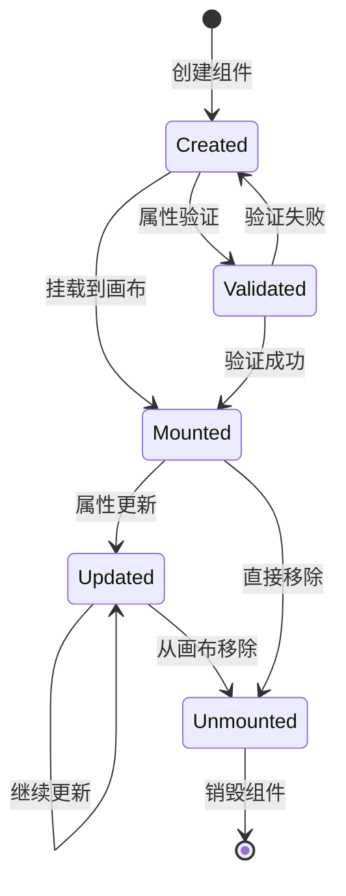
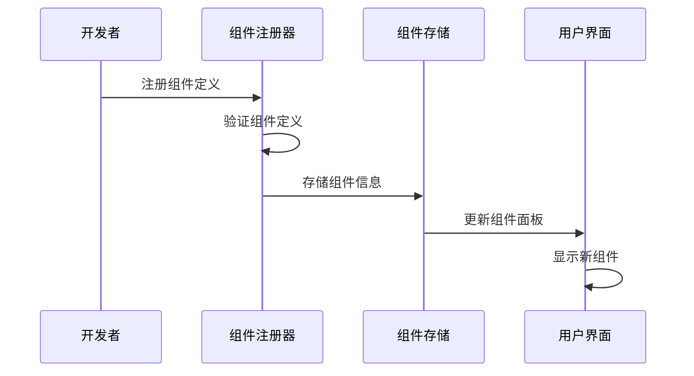
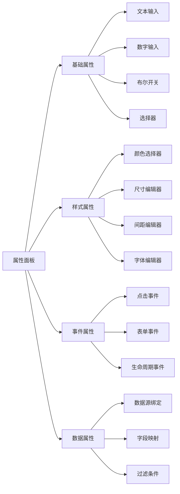
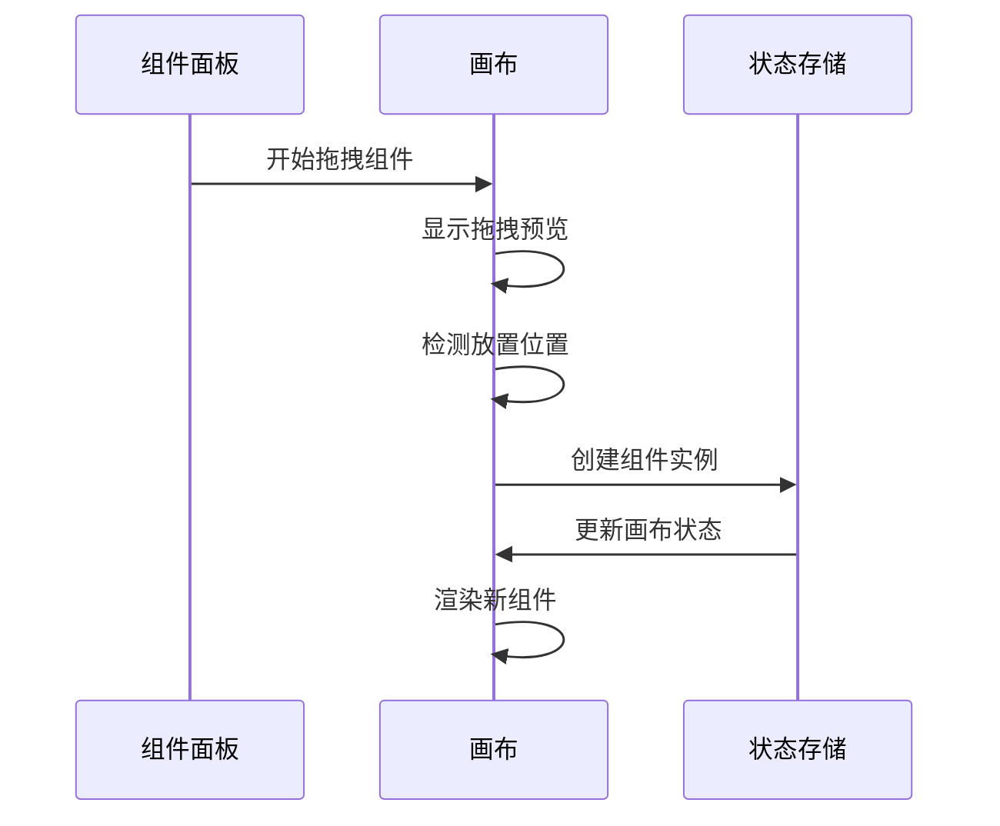
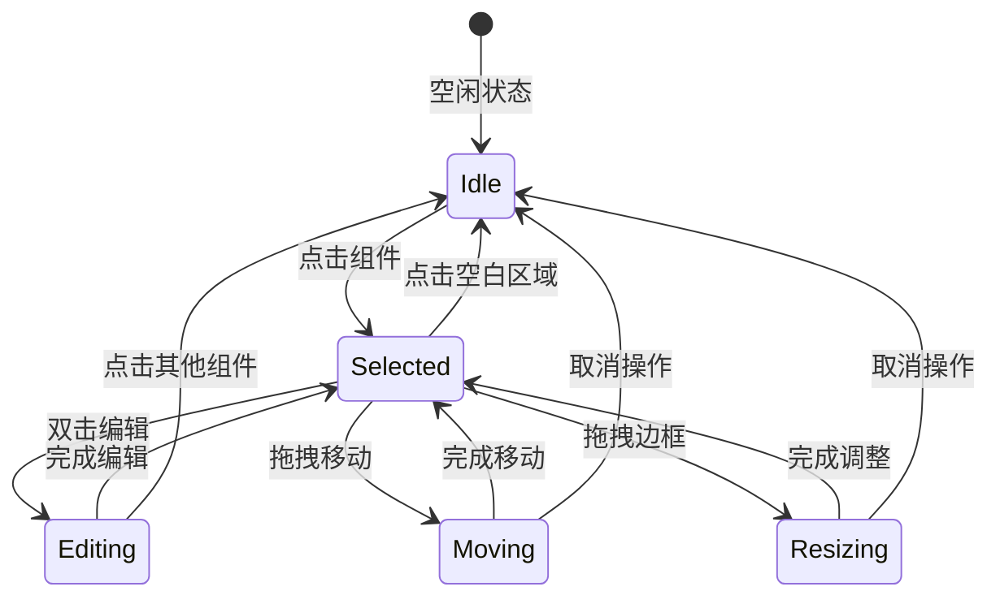
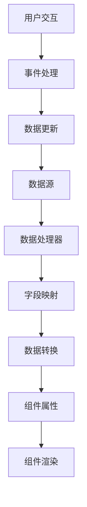

# 组件系统设计文档

## 概述

Felix 低代码平台的组件系统是整个平台的核心，提供了丰富的 UI 组件库和灵活的组件管理机制。

## 组件架构

### 组件分类

```mermaid
graph TD
    A[组件系统] --> B[基础组件]
    A --> C[布局组件]
    A --> D[表单组件]
    A --> E[数据展示组件]
    A --> F[反馈组件]
    A --> G[导航组件]
    A --> H[自定义组件]
    
    B --> B1[Button 按钮]
    B --> B2[Text 文本]
    B --> B3[Image 图片]
    B --> B4[Icon 图标]
    
    C --> C1[Container 容器]
    C --> C2[Grid 网格]
    C --> C3[Flex 弹性布局]
    C --> C4[Card 卡片]
    
    D --> D1[Input 输入框]
    D --> D2[Select 选择器]
    D --> D3[Checkbox 复选框]
    D --> D4[Radio 单选框]
    D --> D5[DatePicker 日期选择]
    
    E --> E1[Table 表格]
    E --> E2[Chart 图表]
    E --> E3[List 列表]
    E --> E4[Tree 树形控件]
    
    F --> F1[Alert 警告]
    F --> F2[Modal 模态框]
    F --> F3[Toast 提示]
    F --> F4[Loading 加载]
    
    G --> G1[Menu 菜单]
    G --> G2[Breadcrumb 面包屑]
    G --> G3[Tabs 标签页]
    G --> G4[Pagination 分页]
```



### 组件生命周期



## 组件模型设计

### 核心接口

```typescript
interface ComponentDefinition {
  // 基本信息
  id: string;
  name: string;
  type: string;
  category: ComponentCategory;
  
  // 显示信息
  displayName: string;
  description: string;
  icon: React.ReactNode;
  
  // 配置信息
  defaultProps: Record<string, any>;
  propSchema: PropSchema;
  
  // 行为配置
  isContainer: boolean;
  allowedChildren?: string[];
  maxChildren?: number;
  
  // 渲染函数
  render: (props: any, children?: React.ReactNode) => React.ReactNode;
}
```

### 属性模式定义

```typescript
interface PropSchema {
  [propName: string]: {
    type: 'string' | 'number' | 'boolean' | 'object' | 'array' | 'color' | 'image';
    label: string;
    description?: string;
    defaultValue?: any;
    required?: boolean;
    options?: Array<{ label: string; value: any }>;
    validation?: ValidationRule[];
    group?: string;
    conditional?: ConditionalRule;
  };
}
```

## 组件注册机制

### 组件注册流程



### 注册示例

```typescript
// 注册基础按钮组件
registerComponent({
  id: 'button',
  name: 'Button',
  type: 'button',
  category: 'basic',
  displayName: '按钮',
  description: '可点击的按钮组件',
  icon: <ButtonIcon />,
  isContainer: false,
  defaultProps: {
    text: '按钮',
    type: 'primary',
    size: 'medium',
    disabled: false,
  },
  propSchema: {
    text: {
      type: 'string',
      label: '按钮文本',
      defaultValue: '按钮',
      required: true,
    },
    type: {
      type: 'string',
      label: '按钮类型',
      defaultValue: 'primary',
      options: [
        { label: '主要', value: 'primary' },
        { label: '次要', value: 'secondary' },
        { label: '危险', value: 'danger' },
      ],
    },
    size: {
      type: 'string',
      label: '按钮大小',
      defaultValue: 'medium',
      options: [
        { label: '小', value: 'small' },
        { label: '中', value: 'medium' },
        { label: '大', value: 'large' },
      ],
    },
    disabled: {
      type: 'boolean',
      label: '禁用状态',
      defaultValue: false,
    },
  },
  render: (props) => (
    <Button
      type={props.type}
      size={props.size}
      disabled={props.disabled}
    >
      {props.text}
    </Button>
  ),
});
```

## 组件属性系统

### 属性编辑器



### 属性验证

```typescript
interface ValidationRule {
  type: 'required' | 'min' | 'max' | 'pattern' | 'custom';
  value?: any;
  message: string;
  validator?: (value: any) => boolean;
}

// 验证示例
const textValidation: ValidationRule[] = [
  {
    type: 'required',
    message: '文本内容不能为空',
  },
  {
    type: 'min',
    value: 1,
    message: '文本长度至少为1个字符',
  },
  {
    type: 'max',
    value: 100,
    message: '文本长度不能超过100个字符',
  },
];
```

## 组件交互系统

### 拖拽机制



### 选择和编辑



## 组件数据绑定

### 数据绑定流程



### 绑定配置

```typescript
interface DataBinding {
  sourceId: string;          // 数据源ID
  fieldPath: string;         // 字段路径
  targetProp: string;        // 目标属性
  transformer?: string;      // 数据转换器
  defaultValue?: any;        // 默认值
  condition?: string;        // 绑定条件
}

// 绑定示例
const tableBinding: DataBinding = {
  sourceId: 'userList',
  fieldPath: 'data.users',
  targetProp: 'dataSource',
  transformer: 'arrayToTableData',
  defaultValue: [],
};
```

## 自定义组件开发

### 开发流程

1. **定义组件接口**: 确定组件的属性和行为
2. **实现组件逻辑**: 编写组件的渲染和交互逻辑
3. **配置属性模式**: 定义组件的可配置属性
4. **注册组件**: 将组件注册到平台中
5. **测试验证**: 确保组件功能正常

### 开发示例

```typescript
// 自定义计数器组件
const CounterComponent: ComponentDefinition = {
  id: 'counter',
  name: 'Counter',
  type: 'counter',
  category: 'custom',
  displayName: '计数器',
  description: '可增减的数字计数器',
  icon: <CounterIcon />,
  isContainer: false,
  defaultProps: {
    initialValue: 0,
    step: 1,
    min: 0,
    max: 100,
  },
  propSchema: {
    initialValue: {
      type: 'number',
      label: '初始值',
      defaultValue: 0,
    },
    step: {
      type: 'number',
      label: '步长',
      defaultValue: 1,
    },
    min: {
      type: 'number',
      label: '最小值',
      defaultValue: 0,
    },
    max: {
      type: 'number',
      label: '最大值',
      defaultValue: 100,
    },
  },
  render: (props) => {
    const [count, setCount] = useState(props.initialValue);
    
    const increment = () => {
      setCount(prev => Math.min(prev + props.step, props.max));
    };
    
    const decrement = () => {
      setCount(prev => Math.max(prev - props.step, props.min));
    };
    
    return (
      <div className="counter">
        <button onClick={decrement}>-</button>
        <span>{count}</span>
        <button onClick={increment}>+</button>
      </div>
    );
  },
};
```

## 组件性能优化

### 渲染优化

1. **虚拟化**: 对大量组件使用虚拟滚动
2. **懒加载**: 按需加载组件定义
3. **缓存**: 缓存组件渲染结果
4. **批量更新**: 合并多个属性更新

### 内存管理

1. **组件销毁**: 及时清理组件资源
2. **事件解绑**: 移除事件监听器
3. **引用清理**: 避免内存泄漏

## 组件测试策略

### 单元测试

```typescript
describe('Button Component', () => {
  it('should render with correct text', () => {
    const props = { text: 'Test Button' };
    const component = render(ButtonComponent.render(props));
    expect(component.getByText('Test Button')).toBeInTheDocument();
  });
  
  it('should handle click events', () => {
    const onClick = jest.fn();
    const props = { text: 'Click Me', onClick };
    const component = render(ButtonComponent.render(props));
    fireEvent.click(component.getByText('Click Me'));
    expect(onClick).toHaveBeenCalled();
  });
});
```

### 集成测试

测试组件在平台中的集成表现，包括拖拽、属性编辑、数据绑定等功能。

### 视觉回归测试

使用截图对比确保组件样式的一致性。