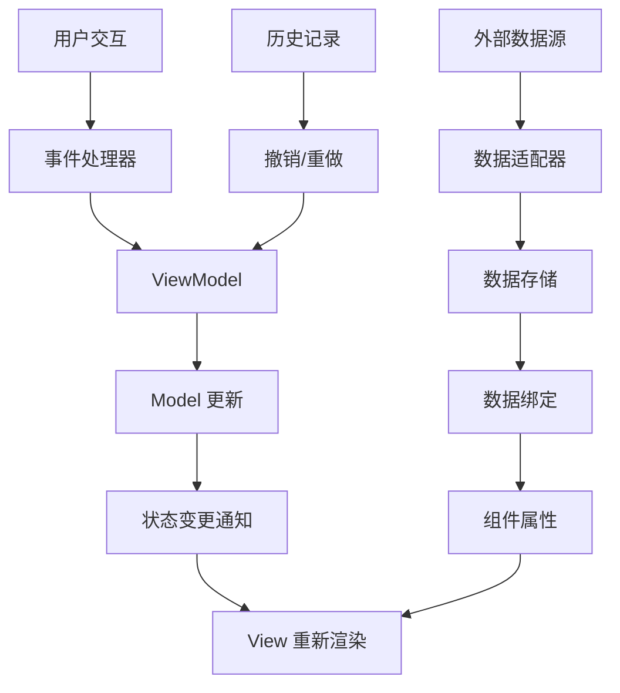
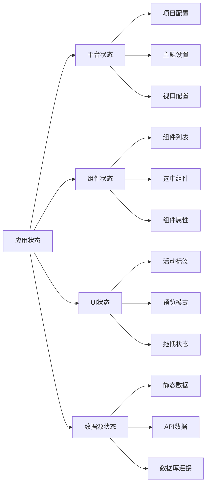
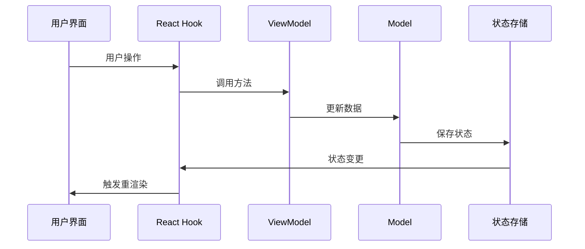
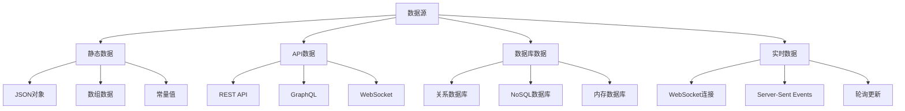
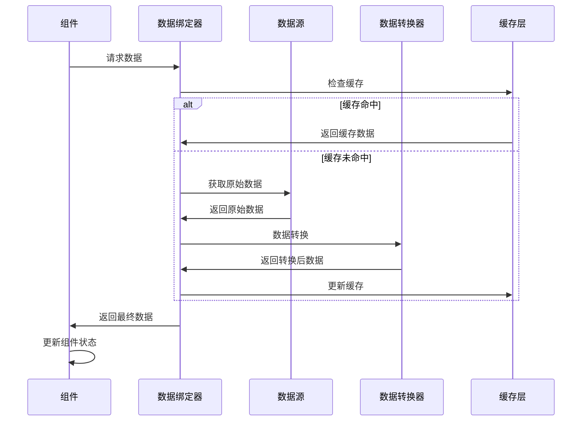
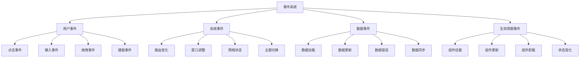
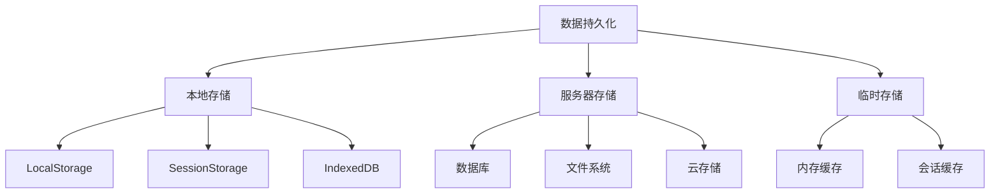
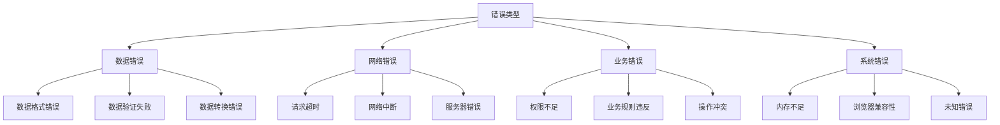

# 数据流设计文档

## 概述

Felix 低代码平台采用单向数据流架构，确保数据的一致性和可预测性。本文档详细描述了平台中数据的流动机制、状态管理策略和数据绑定系统。

## 数据流架构

### 整体数据流



### 数据层级结构



## 状态管理系统

### 状态分类

#### 1. 全局状态 (Global State)
- 项目配置信息
- 主题设置
- 用户偏好设置

#### 2. 模块状态 (Module State)
- 组件管理状态
- 画布状态
- 属性面板状态

#### 3. 局部状态 (Local State)
- 组件内部状态
- 表单输入状态
- 临时UI状态

### 状态管理流程



### Hook 设计模式

```typescript
// 平台状态管理 Hook
export function usePlatformViewModel() {
  const [state, setState] = useState<PlatformModel>(createDefaultPlatformModel());
  const [history, setHistory] = useState<PlatformModel[]>([]);
  const [historyIndex, setHistoryIndex] = useState(0);
  
  // 状态更新方法
  const updateState = useCallback((updater: (prev: PlatformModel) => PlatformModel) => {
    setState(prev => {
      const newState = updater(prev);
      // 添加到历史记录
      addToHistory(newState);
      return newState;
    });
  }, []);
  
  // 撤销操作
  const undo = useCallback(() => {
    if (historyIndex > 0) {
      const prevState = history[historyIndex - 1];
      setState(prevState);
      setHistoryIndex(historyIndex - 1);
    }
  }, [history, historyIndex]);
  
  // 重做操作
  const redo = useCallback(() => {
    if (historyIndex < history.length - 1) {
      const nextState = history[historyIndex + 1];
      setState(nextState);
      setHistoryIndex(historyIndex + 1);
    }
  }, [history, historyIndex]);
  
  return {
    state,
    updateState,
    undo,
    redo,
    canUndo: historyIndex > 0,
    canRedo: historyIndex < history.length - 1,
  };
}
```

## 数据绑定系统

### 数据源类型



### 数据绑定配置

```typescript
interface DataSourceConfig {
  id: string;
  name: string;
  type: 'static' | 'api' | 'database' | 'realtime';
  config: {
    // 静态数据配置
    data?: any;
    
    // API配置
    url?: string;
    method?: 'GET' | 'POST' | 'PUT' | 'DELETE';
    headers?: Record<string, string>;
    params?: Record<string, any>;
    
    // 数据库配置
    connection?: string;
    query?: string;
    
    // 实时数据配置
    endpoint?: string;
    protocol?: 'websocket' | 'sse' | 'polling';
    interval?: number;
  };
  
  // 数据转换
  transformer?: string;
  
  // 缓存配置
  cache?: {
    enabled: boolean;
    ttl: number;
  };
  
  // 错误处理
  errorHandling?: {
    retry: number;
    fallback?: any;
  };
}
```

### 数据绑定流程



## 事件系统

### 事件类型



### 事件处理机制

```typescript
interface EventHandler {
  id: string;
  type: string;
  condition?: string;
  actions: EventAction[];
}

interface EventAction {
  type: 'updateState' | 'callApi' | 'navigate' | 'showMessage';
  config: Record<string, any>;
}

// 事件处理示例
const buttonClickHandler: EventHandler = {
  id: 'button-click-1',
  type: 'click',
  condition: 'user.isLoggedIn',
  actions: [
    {
      type: 'callApi',
      config: {
        url: '/api/submit',
        method: 'POST',
        data: '${form.values}',
      },
    },
    {
      type: 'showMessage',
      config: {
        type: 'success',
        message: '提交成功',
      },
    },
  ],
};
```

## 数据持久化

### 存储策略



### 数据同步机制

```typescript
interface SyncConfig {
  enabled: boolean;
  strategy: 'manual' | 'auto' | 'realtime';
  interval?: number;
  conflictResolution: 'client' | 'server' | 'merge';
}

class DataSyncManager {
  private config: SyncConfig;
  private syncQueue: SyncOperation[] = [];
  
  async sync(): Promise<void> {
    // 获取本地变更
    const localChanges = await this.getLocalChanges();
    
    // 获取服务器变更
    const serverChanges = await this.getServerChanges();
    
    // 冲突检测和解决
    const conflicts = this.detectConflicts(localChanges, serverChanges);
    const resolved = await this.resolveConflicts(conflicts);
    
    // 应用变更
    await this.applyChanges(resolved);
    
    // 清理同步队列
    this.clearSyncQueue();
  }
}
```

## 性能优化

### 数据流优化策略

1. **批量更新**: 合并多个状态更新操作
2. **懒加载**: 按需加载数据和组件
3. **虚拟化**: 大数据集的虚拟滚动
4. **缓存策略**: 智能缓存频繁访问的数据
5. **防抖节流**: 限制高频操作的执行频率

### 内存管理

```typescript
class MemoryManager {
  private cache = new Map<string, any>();
  private maxSize = 100;
  private ttl = 5 * 60 * 1000; // 5分钟
  
  set(key: string, value: any): void {
    // 检查缓存大小
    if (this.cache.size >= this.maxSize) {
      this.evictOldest();
    }
    
    // 设置过期时间
    const item = {
      value,
      timestamp: Date.now(),
    };
    
    this.cache.set(key, item);
  }
  
  get(key: string): any {
    const item = this.cache.get(key);
    
    if (!item) return null;
    
    // 检查是否过期
    if (Date.now() - item.timestamp > this.ttl) {
      this.cache.delete(key);
      return null;
    }
    
    return item.value;
  }
  
  private evictOldest(): void {
    const oldest = Array.from(this.cache.entries())
      .sort(([, a], [, b]) => a.timestamp - b.timestamp)[0];
    
    if (oldest) {
      this.cache.delete(oldest[0]);
    }
  }
}
```

## 错误处理

### 错误分类



### 错误处理策略

```typescript
interface ErrorHandler {
  type: string;
  handler: (error: Error, context: any) => void;
  retry?: {
    maxAttempts: number;
    delay: number;
    backoff: 'linear' | 'exponential';
  };
  fallback?: any;
}

class ErrorManager {
  private handlers = new Map<string, ErrorHandler>();
  
  register(type: string, handler: ErrorHandler): void {
    this.handlers.set(type, handler);
  }
  
  async handle(error: Error, context: any): Promise<void> {
    const handler = this.handlers.get(error.constructor.name);
    
    if (handler) {
      try {
        await handler.handler(error, context);
      } catch (handlerError) {
        console.error('Error handler failed:', handlerError);
        this.handleFallback(error, context, handler.fallback);
      }
    } else {
      this.handleUnknownError(error, context);
    }
  }
  
  private handleFallback(error: Error, context: any, fallback?: any): void {
    if (fallback) {
      // 应用回退策略
      console.warn('Applying fallback for error:', error.message);
    }
  }
  
  private handleUnknownError(error: Error, context: any): void {
    console.error('Unknown error:', error, context);
    // 上报错误到监控系统
  }
}
```

## 调试和监控

### 数据流追踪

```typescript
interface DataFlowTrace {
  id: string;
  timestamp: number;
  source: string;
  target: string;
  data: any;
  duration: number;
}

class DataFlowTracker {
  private traces: DataFlowTrace[] = [];
  private enabled = process.env.NODE_ENV === 'development';
  
  trace(source: string, target: string, data: any): string {
    if (!this.enabled) return '';
    
    const id = `trace-${Date.now()}-${Math.random().toString(36).substr(2, 9)}`;
    const trace: DataFlowTrace = {
      id,
      timestamp: Date.now(),
      source,
      target,
      data: this.sanitizeData(data),
      duration: 0,
    };
    
    this.traces.push(trace);
    return id;
  }
  
  endTrace(id: string): void {
    const trace = this.traces.find(t => t.id === id);
    if (trace) {
      trace.duration = Date.now() - trace.timestamp;
    }
  }
  
  getTraces(): DataFlowTrace[] {
    return this.traces.slice();
  }
  
  private sanitizeData(data: any): any {
    // 移除敏感信息
    return JSON.parse(JSON.stringify(data));
  }
}
```