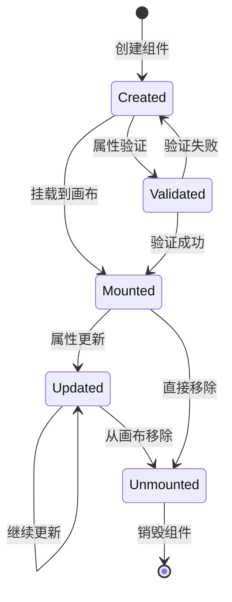
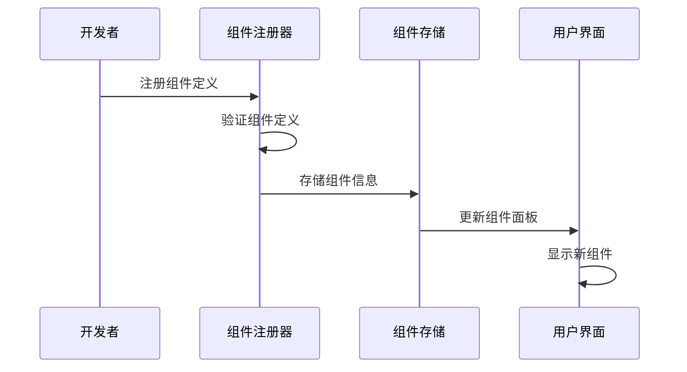
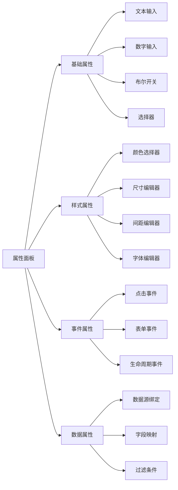
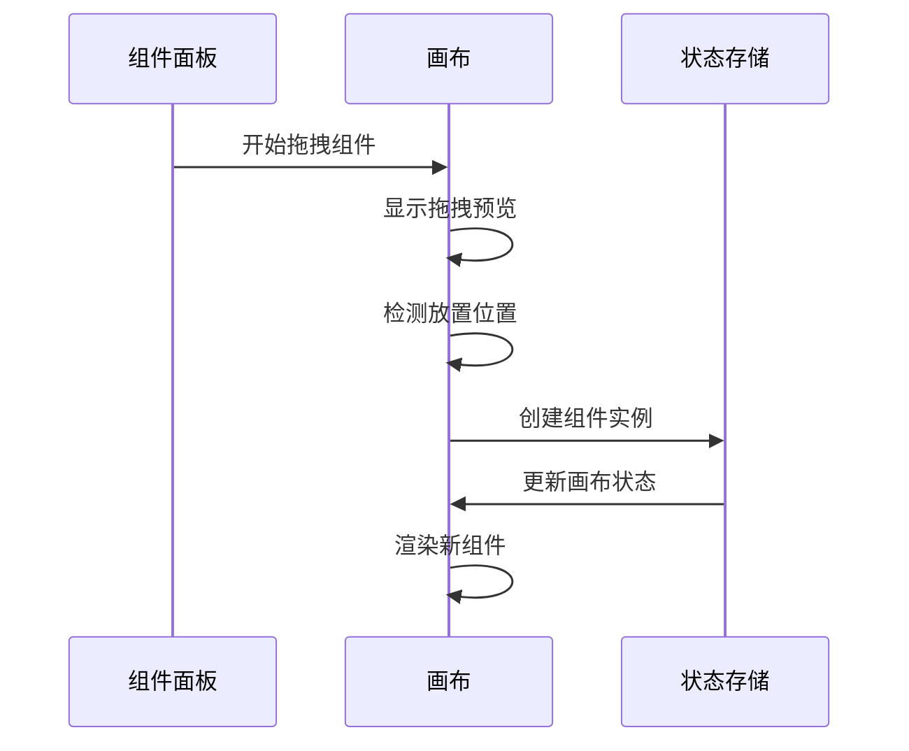
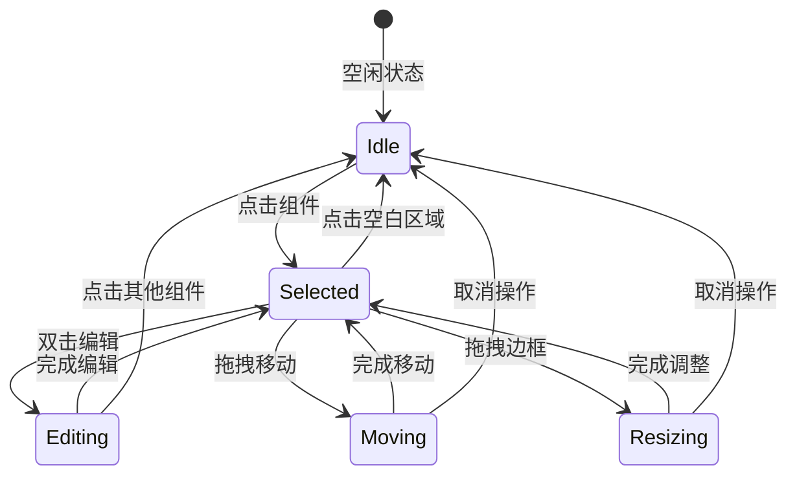
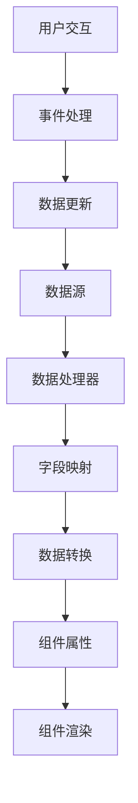

# 组件系统设计文档

## 概述

Felix 低代码平台的组件系统是整个平台的核心，提供了丰富的 UI 组件库和灵活的组件管理机制。

## 组件架构

### 组件分类

```mermaid
graph TD
    A[组件系统] --> B[基础组件]
    A --> C[布局组件]
    A --> D[表单组件]
    A --> E[数据展示组件]
    A --> F[反馈组件]
    A --> G[导航组件]
    A --> H[自定义组件]
    
    B --> B1[Button 按钮]
    B --> B2[Text 文本]
    B --> B3[Image 图片]
    B --> B4[Icon 图标]
    
    C --> C1[Container 容器]
    C --> C2[Grid 网格]
    C --> C3[Flex 弹性布局]
    C --> C4[Card 卡片]
    
    D --> D1[Input 输入框]
    D --> D2[Select 选择器]
    D --> D3[Checkbox 复选框]
    D --> D4[Radio 单选框]
    D --> D5[DatePicker 日期选择]
    
    E --> E1[Table 表格]
    E --> E2[Chart 图表]
    E --> E3[List 列表]
    E --> E4[Tree 树形控件]
    
    F --> F1[Alert 警告]
    F --> F2[Modal 模态框]
    F --> F3[Toast 提示]
    F --> F4[Loading 加载]
    
    G --> G1[Menu 菜单]
    G --> G2[Breadcrumb 面包屑]
    G --> G3[Tabs 标签页]
    G --> G4[Pagination 分页]
```



### 组件生命周期



## 组件模型设计

### 核心接口

```typescript
interface ComponentDefinition {
  // 基本信息
  id: string;
  name: string;
  type: string;
  category: ComponentCategory;
  
  // 显示信息
  displayName: string;
  description: string;
  icon: React.ReactNode;
  
  // 配置信息
  defaultProps: Record<string, any>;
  propSchema: PropSchema;
  
  // 行为配置
  isContainer: boolean;
  allowedChildren?: string[];
  maxChildren?: number;
  
  // 渲染函数
  render: (props: any, children?: React.ReactNode) => React.ReactNode;
}
```

### 属性模式定义

```typescript
interface PropSchema {
  [propName: string]: {
    type: 'string' | 'number' | 'boolean' | 'object' | 'array' | 'color' | 'image';
    label: string;
    description?: string;
    defaultValue?: any;
    required?: boolean;
    options?: Array<{ label: string; value: any }>;
    validation?: ValidationRule[];
    group?: string;
    conditional?: ConditionalRule;
  };
}
```

## 组件注册机制

### 组件注册流程



### 注册示例

```typescript
// 注册基础按钮组件
registerComponent({
  id: 'button',
  name: 'Button',
  type: 'button',
  category: 'basic',
  displayName: '按钮',
  description: '可点击的按钮组件',
  icon: <ButtonIcon />,
  isContainer: false,
  defaultProps: {
    text: '按钮',
    type: 'primary',
    size: 'medium',
    disabled: false,
  },
  propSchema: {
    text: {
      type: 'string',
      label: '按钮文本',
      defaultValue: '按钮',
      required: true,
    },
    type: {
      type: 'string',
      label: '按钮类型',
      defaultValue: 'primary',
      options: [
        { label: '主要', value: 'primary' },
        { label: '次要', value: 'secondary' },
        { label: '危险', value: 'danger' },
      ],
    },
    size: {
      type: 'string',
      label: '按钮大小',
      defaultValue: 'medium',
      options: [
        { label: '小', value: 'small' },
        { label: '中', value: 'medium' },
        { label: '大', value: 'large' },
      ],
    },
    disabled: {
      type: 'boolean',
      label: '禁用状态',
      defaultValue: false,
    },
  },
  render: (props) => (
    <Button
      type={props.type}
      size={props.size}
      disabled={props.disabled}
    >
      {props.text}
    </Button>
  ),
});
```

## 组件属性系统

### 属性编辑器



### 属性验证

```typescript
interface ValidationRule {
  type: 'required' | 'min' | 'max' | 'pattern' | 'custom';
  value?: any;
  message: string;
  validator?: (value: any) => boolean;
}

// 验证示例
const textValidation: ValidationRule[] = [
  {
    type: 'required',
    message: '文本内容不能为空',
  },
  {
    type: 'min',
    value: 1,
    message: '文本长度至少为1个字符',
  },
  {
    type: 'max',
    value: 100,
    message: '文本长度不能超过100个字符',
  },
];
```

## 组件交互系统

### 拖拽机制



### 选择和编辑



## 组件数据绑定

### 数据绑定流程



### 绑定配置

```typescript
interface DataBinding {
  sourceId: string;          // 数据源ID
  fieldPath: string;         // 字段路径
  targetProp: string;        // 目标属性
  transformer?: string;      // 数据转换器
  defaultValue?: any;        // 默认值
  condition?: string;        // 绑定条件
}

// 绑定示例
const tableBinding: DataBinding = {
  sourceId: 'userList',
  fieldPath: 'data.users',
  targetProp: 'dataSource',
  transformer: 'arrayToTableData',
  defaultValue: [],
};
```

## 自定义组件开发

### 开发流程

1. **定义组件接口**: 确定组件的属性和行为
2. **实现组件逻辑**: 编写组件的渲染和交互逻辑
3. **配置属性模式**: 定义组件的可配置属性
4. **注册组件**: 将组件注册到平台中
5. **测试验证**: 确保组件功能正常

### 开发示例

```typescript
// 自定义计数器组件
const CounterComponent: ComponentDefinition = {
  id: 'counter',
  name: 'Counter',
  type: 'counter',
  category: 'custom',
  displayName: '计数器',
  description: '可增减的数字计数器',
  icon: <CounterIcon />,
  isContainer: false,
  defaultProps: {
    initialValue: 0,
    step: 1,
    min: 0,
    max: 100,
  },
  propSchema: {
    initialValue: {
      type: 'number',
      label: '初始值',
      defaultValue: 0,
    },
    step: {
      type: 'number',
      label: '步长',
      defaultValue: 1,
    },
    min: {
      type: 'number',
      label: '最小值',
      defaultValue: 0,
    },
    max: {
      type: 'number',
      label: '最大值',
      defaultValue: 100,
    },
  },
  render: (props) => {
    const [count, setCount] = useState(props.initialValue);
    
    const increment = () => {
      setCount(prev => Math.min(prev + props.step, props.max));
    };
    
    const decrement = () => {
      setCount(prev => Math.max(prev - props.step, props.min));
    };
    
    return (
      <div className="counter">
        <button onClick={decrement}>-</button>
        <span>{count}</span>
        <button onClick={increment}>+</button>
      </div>
    );
  },
};
```

## 组件性能优化

### 渲染优化

1. **虚拟化**: 对大量组件使用虚拟滚动
2. **懒加载**: 按需加载组件定义
3. **缓存**: 缓存组件渲染结果
4. **批量更新**: 合并多个属性更新

### 内存管理

1. **组件销毁**: 及时清理组件资源
2. **事件解绑**: 移除事件监听器
3. **引用清理**: 避免内存泄漏

## 组件测试策略

### 单元测试

```typescript
describe('Button Component', () => {
  it('should render with correct text', () => {
    const props = { text: 'Test Button' };
    const component = render(ButtonComponent.render(props));
    expect(component.getByText('Test Button')).toBeInTheDocument();
  });
  
  it('should handle click events', () => {
    const onClick = jest.fn();
    const props = { text: 'Click Me', onClick };
    const component = render(ButtonComponent.render(props));
    fireEvent.click(component.getByText('Click Me'));
    expect(onClick).toHaveBeenCalled();
  });
});
```

### 集成测试

测试组件在平台中的集成表现，包括拖拽、属性编辑、数据绑定等功能。

### 视觉回归测试

使用截图对比确保组件样式的一致性。

## 内置组件库

### 基础组件

#### Button 按钮
```typescript
interface ButtonProps {
  text: string;
  type: 'primary' | 'secondary' | 'danger' | 'ghost';
  size: 'small' | 'medium' | 'large';
  disabled: boolean;
  loading: boolean;
  icon?: string;
  onClick?: () => void;
}
```

**使用场景**: 用户操作触发、表单提交、页面跳转等

#### Text 文本
```typescript
interface TextProps {
  content: string;
  tag: 'p' | 'span' | 'h1' | 'h2' | 'h3' | 'h4' | 'h5' | 'h6';
  color: string;
  fontSize: string;
  fontWeight: 'normal' | 'bold' | '100' | '200' | '300' | '400' | '500' | '600' | '700' | '800' | '900';
  textAlign: 'left' | 'center' | 'right' | 'justify';
  lineHeight: string;
}
```

**使用场景**: 标题、段落、标签、说明文字等

#### Image 图片
```typescript
interface ImageProps {
  src: string;
  alt: string;
  width: string | number;
  height: string | number;
  fit: 'contain' | 'cover' | 'fill' | 'none' | 'scale-down';
  lazy: boolean;
  placeholder?: string;
  fallback?: string;
}
```

**使用场景**: 产品图片、头像、装饰图片、图标等

### 布局组件

#### Container 容器
```typescript
interface ContainerProps {
  padding: string;
  margin: string;
  backgroundColor: string;
  borderRadius: string;
  border: string;
  boxShadow: string;
  maxWidth: string;
  minHeight: string;
  display: 'block' | 'flex' | 'grid' | 'inline-block';
  children: React.ReactNode;
}
```

**使用场景**: 页面布局、内容分组、卡片容器等

#### Grid 网格
```typescript
interface GridProps {
  columns: number;
  rows: number;
  gap: string;
  columnGap: string;
  rowGap: string;
  alignItems: 'start' | 'center' | 'end' | 'stretch';
  justifyItems: 'start' | 'center' | 'end' | 'stretch';
  children: React.ReactNode;
}
```

**使用场景**: 复杂布局、响应式网格、卡片列表等

#### Flex 弹性布局
```typescript
interface FlexProps {
  direction: 'row' | 'column' | 'row-reverse' | 'column-reverse';
  wrap: 'nowrap' | 'wrap' | 'wrap-reverse';
  justifyContent: 'flex-start' | 'flex-end' | 'center' | 'space-between' | 'space-around' | 'space-evenly';
  alignItems: 'flex-start' | 'flex-end' | 'center' | 'baseline' | 'stretch';
  gap: string;
  children: React.ReactNode;
}
```

**使用场景**: 导航栏、工具栏、按钮组、垂直居中等

### 表单组件

#### Input 输入框
```typescript
interface InputProps {
  value: string;
  placeholder: string;
  type: 'text' | 'password' | 'email' | 'number' | 'tel' | 'url';
  disabled: boolean;
  readonly: boolean;
  required: boolean;
  maxLength: number;
  pattern: string;
  size: 'small' | 'medium' | 'large';
  prefix?: string;
  suffix?: string;
  onChange?: (value: string) => void;
  onBlur?: () => void;
  onFocus?: () => void;
}
```

**使用场景**: 用户信息输入、搜索框、表单字段等

#### Select 选择器
```typescript
interface SelectProps {
  value: string | string[];
  options: Array<{ label: string; value: string; disabled?: boolean }>;
  placeholder: string;
  disabled: boolean;
  multiple: boolean;
  searchable: boolean;
  clearable: boolean;
  size: 'small' | 'medium' | 'large';
  onChange?: (value: string | string[]) => void;
}
```

**使用场景**: 下拉选择、多选、分类筛选等

#### Checkbox 复选框
```typescript
interface CheckboxProps {
  checked: boolean;
  label: string;
  disabled: boolean;
  indeterminate: boolean;
  value: string;
  onChange?: (checked: boolean) => void;
}
```

**使用场景**: 多项选择、开关设置、协议同意等

### 数据展示组件

#### Table 表格
```typescript
interface TableProps {
  dataSource: any[];
  columns: Array<{
    key: string;
    title: string;
    dataIndex: string;
    width?: number;
    align?: 'left' | 'center' | 'right';
    sorter?: boolean;
    render?: (value: any, record: any, index: number) => React.ReactNode;
  }>;
  pagination: {
    current: number;
    pageSize: number;
    total: number;
    showSizeChanger: boolean;
    showQuickJumper: boolean;
  };
  loading: boolean;
  bordered: boolean;
  size: 'small' | 'medium' | 'large';
  onRowClick?: (record: any, index: number) => void;
}
```

**使用场景**: 数据列表、报表展示、管理后台等

#### Chart 图表
```typescript
interface ChartProps {
  type: 'line' | 'bar' | 'pie' | 'area' | 'scatter';
  data: any[];
  xField: string;
  yField: string;
  seriesField?: string;
  width: number;
  height: number;
  title: string;
  legend: boolean;
  tooltip: boolean;
  theme: 'light' | 'dark';
}
```

**使用场景**: 数据可视化、统计报表、趋势分析等

### 反馈组件

#### Modal 模态框
```typescript
interface ModalProps {
  visible: boolean;
  title: string;
  width: number;
  height: number;
  closable: boolean;
  maskClosable: boolean;
  centered: boolean;
  destroyOnClose: boolean;
  children: React.ReactNode;
  onOk?: () => void;
  onCancel?: () => void;
}
```

**使用场景**: 确认对话框、表单弹窗、详情展示等

#### Alert 警告提示
```typescript
interface AlertProps {
  type: 'success' | 'info' | 'warning' | 'error';
  message: string;
  description?: string;
  showIcon: boolean;
  closable: boolean;
  banner: boolean;
  onClose?: () => void;
}
```

**使用场景**: 操作反馈、系统通知、错误提示等

## 组件扩展机制

### 插件系统

```typescript
interface ComponentPlugin {
  id: string;
  name: string;
  version: string;
  components: ComponentDefinition[];
  install: (platform: PlatformAPI) => void;
  uninstall: () => void;
}

// 插件示例
const ChartPlugin: ComponentPlugin = {
  id: 'chart-plugin',
  name: '图表插件',
  version: '1.0.0',
  components: [LineChart, BarChart, PieChart],
  install: (platform) => {
    this.components.forEach(component => {
      platform.registerComponent(component);
    });
  },
  uninstall: () => {
    this.components.forEach(component => {
      platform.unregisterComponent(component.id);
    });
  }
};
```

### 主题系统集成

```typescript
interface ComponentTheme {
  colors: {
    primary: string;
    secondary: string;
    success: string;
    warning: string;
    error: string;
  };
  fonts: {
    family: string;
    sizes: Record<string, string>;
    weights: Record<string, number>;
  };
  spacing: Record<string, string>;
  borderRadius: Record<string, string>;
  shadows: Record<string, string>;
}

// 组件主题适配
const ThemedButton = styled.button<{ theme: ComponentTheme }>`
  background-color: ${props => props.theme.colors.primary};
  font-family: ${props => props.theme.fonts.family};
  border-radius: ${props => props.theme.borderRadius.base};
  padding: ${props => props.theme.spacing.md};
`;
```

### 国际化支持

```typescript
interface ComponentI18n {
  [locale: string]: {
    [key: string]: string;
  };
}

const buttonI18n: ComponentI18n = {
  'zh-CN': {
    'button.loading': '加载中...',
    'button.confirm': '确认',
    'button.cancel': '取消',
  },
  'en-US': {
    'button.loading': 'Loading...',
    'button.confirm': 'Confirm',
    'button.cancel': 'Cancel',
  }
};
```

## 组件版本管理

### 版本兼容性

```typescript
interface ComponentVersion {
  version: string;
  compatibility: {
    platform: string;
    dependencies: Record<string, string>;
  };
  migrations?: Array<{
    from: string;
    to: string;
    migrate: (oldProps: any) => any;
  }>;
}

// 版本迁移示例
const buttonMigrations = [
  {
    from: '1.0.0',
    to: '2.0.0',
    migrate: (oldProps: any) => ({
      ...oldProps,
      variant: oldProps.type, // type 重命名为 variant
      size: oldProps.size || 'medium' // 添加默认 size
    })
  }
];
```

### 向后兼容

```typescript
class ComponentCompatibilityManager {
  migrateProps(componentId: string, version: string, props: any): any {
    const component = this.getComponent(componentId);
    const migrations = component.migrations || [];
    
    let migratedProps = props;
    for (const migration of migrations) {
      if (this.shouldMigrate(version, migration.from, migration.to)) {
        migratedProps = migration.migrate(migratedProps);
      }
    }
    
    return migratedProps;
  }
}
```

## 组件文档生成

### 自动文档生成

```typescript
interface ComponentDocumentation {
  id: string;
  name: string;
  description: string;
  props: Array<{
    name: string;
    type: string;
    required: boolean;
    defaultValue: any;
    description: string;
  }>;
  examples: Array<{
    title: string;
    code: string;
    preview: React.ReactNode;
  }>;
}

// 从组件定义生成文档
function generateDocumentation(component: ComponentDefinition): ComponentDocumentation {
  return {
    id: component.id,
    name: component.displayName,
    description: component.description,
    props: Object.entries(component.propSchema).map(([name, schema]) => ({
      name,
      type: schema.type,
      required: schema.required || false,
      defaultValue: schema.defaultValue,
      description: schema.description || ''
    })),
    examples: generateExamples(component)
  };
}
```

### 交互式文档

```typescript
// Storybook 集成
export default {
  title: 'Components/Button',
  component: Button,
  argTypes: {
    type: {
      control: { type: 'select' },
      options: ['primary', 'secondary', 'danger']
    },
    size: {
      control: { type: 'select' },
      options: ['small', 'medium', 'large']
    }
  }
};

export const Primary = {
  args: {
    text: 'Primary Button',
    type: 'primary'
  }
};

export const Secondary = {
  args: {
    text: 'Secondary Button',
    type: 'secondary'
  }
};
```

## 最佳实践

### 组件设计原则

1. **单一职责**: 每个组件只负责一个功能
2. **可复用性**: 设计通用的、可配置的组件
3. **一致性**: 保持 API 和视觉风格的一致性
4. **可访问性**: 支持键盘导航和屏幕阅读器
5. **性能优化**: 避免不必要的重渲染

### 属性设计规范

1. **命名规范**: 使用清晰、一致的属性名
2. **类型安全**: 提供完整的 TypeScript 类型定义
3. **默认值**: 为所有属性提供合理的默认值
4. **验证规则**: 添加必要的属性验证
5. **文档说明**: 为每个属性提供清晰的说明

### 测试策略

1. **单元测试**: 测试组件的基本功能
2. **快照测试**: 确保组件渲染的一致性
3. **交互测试**: 测试用户交互行为
4. **可访问性测试**: 确保组件的可访问性
5. **性能测试**: 监控组件的渲染性能

---

通过完善的组件系统，Felix 低代码平台能够提供丰富、灵活、高质量的组件库，满足各种应用场景的需求。