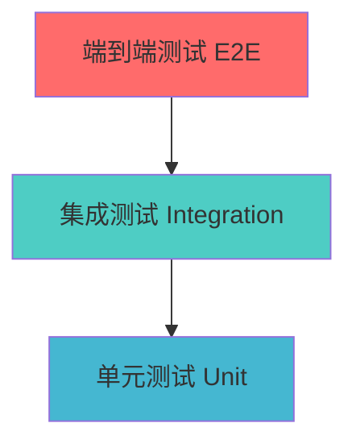

# 测试指南

## 概述

Felix 低代码平台采用全面的测试策略，确保代码质量和系统稳定性。本指南涵盖了测试框架、测试策略、编写规范和最佳实践。

## 测试框架

### 核心测试工具

- **Vitest**: 快速的单元测试框架
- **React Testing Library**: React 组件测试
- **Jest DOM**: DOM 测试断言
- **MSW**: API 模拟
- **Playwright**: 端到端测试

### 测试配置

```typescript
// vitest.config.mjs
import { defineConfig } from 'vitest/config';
import react from '@vitejs/plugin-react';

export default defineConfig({
  plugins: [react()],
  test: {
    environment: 'jsdom',
    setupFiles: ['./test/setup.ts'],
    globals: true,
    coverage: {
      provider: 'v8',
      reporter: ['text', 'json', 'html'],
      exclude: [
        'node_modules/',
        'test/',
        '**/*.d.ts',
        '**/*.config.*'
      ]
    }
  },
  resolve: {
    alias: {
      '@': new URL('./src', import.meta.url).pathname
    }
  }
});
```

## 测试策略

### 测试金字塔



#### 单元测试 (70%)
- 测试独立的函数和组件
- 快速执行，易于维护
- 覆盖边界条件和错误情况

#### 集成测试 (20%)
- 测试组件间的交互
- 验证数据流和状态管理
- 测试 API 集成

#### 端到端测试 (10%)
- 测试完整的用户流程
- 验证关键业务场景
- 跨浏览器兼容性测试

## 单元测试

### 组件测试

#### 基础组件测试

```typescript
// src/mvvm/views/components/Button/Button.test.tsx
import { render, screen, fireEvent } from '@testing-library/react';
import { Button } from './Button';

describe('Button Component', () => {
  it('renders with correct text', () => {
    render(<Button>Click me</Button>);
    expect(screen.getByText('Click me')).toBeInTheDocument();
  });

  it('applies correct variant class', () => {
    render(<Button variant="primary">Primary Button</Button>);
    const button = screen.getByRole('button');
    expect(button).toHaveClass('btn-primary');
  });

  it('calls onClick handler when clicked', () => {
    const handleClick = vi.fn();
    render(<Button onClick={handleClick}>Click me</Button>);
    
    fireEvent.click(screen.getByText('Click me'));
    expect(handleClick).toHaveBeenCalledTimes(1);
  });

  it('is disabled when disabled prop is true', () => {
    render(<Button disabled>Disabled Button</Button>);
    const button = screen.getByRole('button');
    expect(button).toBeDisabled();
  });

  it('renders with custom className', () => {
    render(<Button className="custom-class">Button</Button>);
    const button = screen.getByRole('button');
    expect(button).toHaveClass('custom-class');
  });
});
```

#### 复杂组件测试

```typescript
// src/mvvm/views/components/ComponentPanel/ComponentPanel.test.tsx
import { render, screen, fireEvent, waitFor } from '@testing-library/react';
import { ComponentPanel } from './ComponentPanel';
import { ComponentProvider } from '@/mvvm/contexts/ComponentContext';

const mockComponents = [
  {
    id: 'button',
    name: 'Button',
    category: 'basic',
    displayName: '按钮'
  },
  {
    id: 'input',
    name: 'Input',
    category: 'form',
    displayName: '输入框'
  }
];

const renderWithProvider = (ui: React.ReactElement) => {
  return render(
    <ComponentProvider value={{ components: mockComponents }}>
      {ui}
    </ComponentProvider>
  );
};

describe('ComponentPanel', () => {
  it('renders all component categories', () => {
    renderWithProvider(<ComponentPanel />);
    
    expect(screen.getByText('基础组件')).toBeInTheDocument();
    expect(screen.getByText('表单组件')).toBeInTheDocument();
  });

  it('filters components by search term', async () => {
    renderWithProvider(<ComponentPanel />);
    
    const searchInput = screen.getByPlaceholderText('搜索组件...');
    fireEvent.change(searchInput, { target: { value: '按钮' } });

    await waitFor(() => {
      expect(screen.getByText('按钮')).toBeInTheDocument();
      expect(screen.queryByText('输入框')).not.toBeInTheDocument();
    });
  });

  it('handles component drag start', () => {
    const onDragStart = vi.fn();
    renderWithProvider(<ComponentPanel onDragStart={onDragStart} />);
    
    const buttonComponent = screen.getByText('按钮');
    fireEvent.dragStart(buttonComponent);
    
    expect(onDragStart).toHaveBeenCalledWith('button');
  });
});
```

### Hook 测试

```typescript
// src/mvvm/hooks/usePlatformViewModel.test.ts
import { renderHook, act } from '@testing-library/react';
import { usePlatformViewModel } from './usePlatformViewModel';

describe('usePlatformViewModel', () => {
  it('initializes with default state', () => {
    const { result } = renderHook(() => usePlatformViewModel());
    
    expect(result.current.state.components).toEqual([]);
    expect(result.current.state.selectedComponentId).toBeNull();
    expect(result.current.state.activeTab).toBe('components');
  });

  it('updates active tab', () => {
    const { result } = renderHook(() => usePlatformViewModel());
    
    act(() => {
      result.current.setActiveTab('data');
    });
    
    expect(result.current.state.activeTab).toBe('data');
  });

  it('supports undo/redo operations', () => {
    const { result } = renderHook(() => usePlatformViewModel());
    
    // 初始状态不能撤销
    expect(result.current.canUndo()).toBe(false);
    
    // 进行一个操作
    act(() => {
      result.current.setActiveTab('tree');
    });
    
    // 现在可以撤销
    expect(result.current.canUndo()).toBe(true);
    
    // 执行撤销
    act(() => {
      result.current.undo();
    });
    
    expect(result.current.state.activeTab).toBe('components');
    expect(result.current.canRedo()).toBe(true);
  });
});
```

### ViewModel 测试

```typescript
// src/mvvm/viewmodels/ComponentViewModel.test.ts
import { ComponentViewModel } from './ComponentViewModel';
import { ComponentModel } from '@/mvvm/models/ComponentModel';

describe('ComponentViewModel', () => {
  let viewModel: ComponentViewModel;
  let mockComponent: ComponentModel;

  beforeEach(() => {
    viewModel = new ComponentViewModel();
    mockComponent = {
      id: 'test-component',
      type: 'button',
      name: 'Test Button',
      properties: { text: 'Click me' }
    };
  });

  it('adds component successfully', () => {
    viewModel.addComponent(mockComponent);
    
    expect(viewModel.components).toContain(mockComponent);
    expect(viewModel.selectedComponent).toBe(mockComponent);
  });

  it('updates component properties', () => {
    viewModel.addComponent(mockComponent);
    
    const newProperties = { text: 'Updated text', color: 'blue' };
    viewModel.updateComponentProperties(mockComponent.id, newProperties);
    
    const updatedComponent = viewModel.getComponentById(mockComponent.id);
    expect(updatedComponent?.properties).toEqual({
      text: 'Updated text',
      color: 'blue'
    });
  });

  it('deletes component', () => {
    viewModel.addComponent(mockComponent);
    expect(viewModel.components).toHaveLength(1);
    
    viewModel.deleteComponent(mockComponent.id);
    expect(viewModel.components).toHaveLength(0);
    expect(viewModel.selectedComponent).toBeNull();
  });

  it('duplicates component with new id', () => {
    viewModel.addComponent(mockComponent);
    
    const duplicated = viewModel.duplicateComponent(mockComponent.id);
    
    expect(duplicated).toBeDefined();
    expect(duplicated?.id).not.toBe(mockComponent.id);
    expect(duplicated?.type).toBe(mockComponent.type);
    expect(duplicated?.properties).toEqual(mockComponent.properties);
    expect(viewModel.components).toHaveLength(2);
  });
});
```

### 工具函数测试

```typescript
// src/mvvm/viewmodels/utils.test.ts
import { 
  generateId, 
  validateComponent, 
  transformComponentData,
  deepClone 
} from './utils';

describe('Utils', () => {
  describe('generateId', () => {
    it('generates unique ids', () => {
      const id1 = generateId();
      const id2 = generateId();
      
      expect(id1).not.toBe(id2);
      expect(typeof id1).toBe('string');
      expect(id1.length).toBeGreaterThan(0);
    });

    it('generates id with prefix', () => {
      const id = generateId('component');
      expect(id).toMatch(/^component-/);
    });
  });

  describe('validateComponent', () => {
    it('validates valid component', () => {
      const component = {
        id: 'test-1',
        type: 'button',
        name: 'Test Button'
      };
      
      const result = validateComponent(component);
      expect(result.valid).toBe(true);
      expect(result.errors).toHaveLength(0);
    });

    it('returns errors for invalid component', () => {
      const component = {
        id: '',
        type: 'button'
        // missing name
      };
      
      const result = validateComponent(component);
      expect(result.valid).toBe(false);
      expect(result.errors).toContain('ID is required');
      expect(result.errors).toContain('Name is required');
    });
  });

  describe('deepClone', () => {
    it('creates deep copy of object', () => {
      const original = {
        id: 'test',
        nested: { value: 42 },
        array: [1, 2, 3]
      };
      
      const cloned = deepClone(original);
      
      expect(cloned).toEqual(original);
      expect(cloned).not.toBe(original);
      expect(cloned.nested).not.toBe(original.nested);
      expect(cloned.array).not.toBe(original.array);
    });
  });
});
```

## 集成测试

### 组件交互测试

```typescript
// src/mvvm/views/LowCodePlatformView.test.tsx
import { render, screen, fireEvent, waitFor } from '@testing-library/react';
import { LowCodePlatformView } from './LowCodePlatformView';
import { PlatformProvider } from '@/mvvm/contexts/PlatformContext';

describe('LowCodePlatformView Integration', () => {
  it('adds component from panel to canvas', async () => {
    render(
      <PlatformProvider>
        <LowCodePlatformView />
      </PlatformProvider>
    );

    // 从组件面板拖拽按钮组件
    const buttonComponent = screen.getByText('按钮');
    const canvas = screen.getByTestId('canvas');

    fireEvent.dragStart(buttonComponent);
    fireEvent.dragOver(canvas);
    fireEvent.drop(canvas);

    // 验证组件已添加到画布
    await waitFor(() => {
      expect(screen.getByTestId('canvas')).toContainElement(
        screen.getByTestId('component-button')
      );
    });

    // 验证属性面板显示组件属性
    expect(screen.getByText('按钮属性')).toBeInTheDocument();
  });

  it('updates component properties from properties panel', async () => {
    render(
      <PlatformProvider>
        <LowCodePlatformView />
      </PlatformProvider>
    );

    // 添加组件并选中
    const buttonComponent = screen.getByText('按钮');
    const canvas = screen.getByTestId('canvas');
    
    fireEvent.dragStart(buttonComponent);
    fireEvent.drop(canvas);

    // 在属性面板中修改文本
    const textInput = screen.getByLabelText('按钮文本');
    fireEvent.change(textInput, { target: { value: '新按钮文本' } });

    // 验证画布中的组件已更新
    await waitFor(() => {
      expect(screen.getByText('新按钮文本')).toBeInTheDocument();
    });
  });
});
```

### 数据流测试

```typescript
// src/mvvm/integration/data-flow.test.tsx
import { render, screen, waitFor } from '@testing-library/react';
import { DataProvider } from '@/mvvm/contexts/DataContext';
import { ComponentWithDataBinding } from '@/test/fixtures/ComponentWithDataBinding';

const mockDataSource = {
  id: 'test-api',
  type: 'api',
  config: {
    url: '/api/test-data'
  }
};

describe('Data Flow Integration', () => {
  it('binds data from API to component', async () => {
    // 模拟 API 响应
    global.fetch = vi.fn().mockResolvedValue({
      ok: true,
      json: () => Promise.resolve({
        title: 'Test Title',
        description: 'Test Description'
      })
    });

    render(
      <DataProvider dataSources={[mockDataSource]}>
        <ComponentWithDataBinding 
          dataBinding={{
            sourceId: 'test-api',
            fieldPath: 'title',
            targetProp: 'text'
          }}
        />
      </DataProvider>
    );

    // 等待数据加载并绑定
    await waitFor(() => {
      expect(screen.getByText('Test Title')).toBeInTheDocument();
    });

    expect(global.fetch).toHaveBeenCalledWith('/api/test-data');
  });

  it('handles data binding errors gracefully', async () => {
    // 模拟 API 错误
    global.fetch = vi.fn().mockRejectedValue(new Error('API Error'));

    render(
      <DataProvider dataSources={[mockDataSource]}>
        <ComponentWithDataBinding 
          dataBinding={{
            sourceId: 'test-api',
            fieldPath: 'title',
            targetProp: 'text'
          }}
          fallbackText="加载失败"
        />
      </DataProvider>
    );

    await waitFor(() => {
      expect(screen.getByText('加载失败')).toBeInTheDocument();
    });
  });
});
```

## 端到端测试

### Playwright 配置

```typescript
// playwright.config.ts
import { defineConfig, devices } from '@playwright/test';

export default defineConfig({
  testDir: './e2e',
  fullyParallel: true,
  forbidOnly: !!process.env.CI,
  retries: process.env.CI ? 2 : 0,
  workers: process.env.CI ? 1 : undefined,
  reporter: 'html',
  use: {
    baseURL: 'http://localhost:3000',
    trace: 'on-first-retry',
  },
  projects: [
    {
      name: 'chromium',
      use: { ...devices['Desktop Chrome'] },
    },
    {
      name: 'firefox',
      use: { ...devices['Desktop Firefox'] },
    },
    {
      name: 'webkit',
      use: { ...devices['Desktop Safari'] },
    },
  ],
  webServer: {
    command: 'pnpm dev',
    url: 'http://localhost:3000',
    reuseExistingServer: !process.env.CI,
  },
});
```

### E2E 测试示例

```typescript
// e2e/component-creation.spec.ts
import { test, expect } from '@playwright/test';

test.describe('Component Creation Flow', () => {
  test('user can create a simple page with components', async ({ page }) => {
    await page.goto('/');

    // 等待页面加载
    await expect(page.locator('[data-testid="platform-view"]')).toBeVisible();

    // 从组件面板拖拽按钮到画布
    const buttonComponent = page.locator('[data-testid="component-button"]');
    const canvas = page.locator('[data-testid="canvas"]');

    await buttonComponent.dragTo(canvas);

    // 验证组件已添加到画布
    await expect(canvas.locator('.component-button')).toBeVisible();

    // 选中组件并修改属性
    await canvas.locator('.component-button').click();
    
    const propertiesPanel = page.locator('[data-testid="properties-panel"]');
    await expect(propertiesPanel).toBeVisible();

    const textInput = propertiesPanel.locator('input[name="text"]');
    await textInput.fill('我的按钮');

    // 验证画布中的按钮文本已更新
    await expect(canvas.locator('.component-button')).toContainText('我的按钮');

    // 进入预览模式
    await page.locator('[data-testid="preview-button"]').click();
    
    // 验证预览模式下组件正常显示
    await expect(page.locator('.preview-mode')).toBeVisible();
    await expect(page.locator('button')).toContainText('我的按钮');
  });

  test('user can save and load project', async ({ page }) => {
    await page.goto('/');

    // 创建一个简单的页面
    const buttonComponent = page.locator('[data-testid="component-button"]');
    const canvas = page.locator('[data-testid="canvas"]');
    await buttonComponent.dragTo(canvas);

    // 保存项目
    await page.locator('[data-testid="save-button"]').click();
    
    // 验证保存成功提示
    await expect(page.locator('.toast-success')).toContainText('项目已保存');

    // 刷新页面
    await page.reload();

    // 验证项目已自动加载
    await expect(canvas.locator('.component-button')).toBeVisible();
  });
});
```

### 性能测试

```typescript
// e2e/performance.spec.ts
import { test, expect } from '@playwright/test';

test.describe('Performance Tests', () => {
  test('page loads within acceptable time', async ({ page }) => {
    const startTime = Date.now();
    
    await page.goto('/');
    await expect(page.locator('[data-testid="platform-view"]')).toBeVisible();
    
    const loadTime = Date.now() - startTime;
    expect(loadTime).toBeLessThan(3000); // 3秒内加载完成
  });

  test('handles large number of components', async ({ page }) => {
    await page.goto('/');

    const canvas = page.locator('[data-testid="canvas"]');
    const buttonComponent = page.locator('[data-testid="component-button"]');

    // 添加100个组件
    for (let i = 0; i < 100; i++) {
      await buttonComponent.dragTo(canvas, {
        targetPosition: { x: (i % 10) * 50, y: Math.floor(i / 10) * 50 }
      });
    }

    // 验证所有组件都已添加
    await expect(canvas.locator('.component-button')).toHaveCount(100);

    // 测试选择性能
    const startTime = Date.now();
    await canvas.locator('.component-button').first().click();
    const selectionTime = Date.now() - startTime;
    
    expect(selectionTime).toBeLessThan(100); // 选择操作在100ms内完成
  });
});
```

## 测试数据和模拟

### 测试数据工厂

```typescript
// test/factories/ComponentFactory.ts
import { ComponentModel } from '@/mvvm/models/ComponentModel';

export class ComponentFactory {
  static createButton(overrides: Partial<ComponentModel> = {}): ComponentModel {
    return {
      id: `button-${Date.now()}`,
      type: 'button',
      name: 'Test Button',
      properties: {
        text: 'Click me',
        variant: 'primary',
        size: 'medium'
      },
      position: { x: 0, y: 0 },
      ...overrides
    };
  }

  static createInput(overrides: Partial<ComponentModel> = {}): ComponentModel {
    return {
      id: `input-${Date.now()}`,
      type: 'input',
      name: 'Test Input',
      properties: {
        placeholder: 'Enter text...',
        type: 'text',
        required: false
      },
      position: { x: 0, y: 0 },
      ...overrides
    };
  }

  static createContainer(children: ComponentModel[] = []): ComponentModel {
    return {
      id: `container-${Date.now()}`,
      type: 'container',
      name: 'Test Container',
      properties: {
        padding: '16px',
        backgroundColor: '#ffffff'
      },
      children,
      position: { x: 0, y: 0 }
    };
  }
}
```

### API 模拟

```typescript
// test/mocks/api.ts
import { setupServer } from 'msw/node';
import { rest } from 'msw';

export const server = setupServer(
  // 模拟组件数据 API
  rest.get('/api/components', (req, res, ctx) => {
    return res(
      ctx.json([
        {
          id: 'button',
          name: 'Button',
          category: 'basic',
          displayName: '按钮'
        },
        {
          id: 'input',
          name: 'Input',
          category: 'form',
          displayName: '输入框'
        }
      ])
    );
  }),

  // 模拟数据源 API
  rest.get('/api/data-sources/:id', (req, res, ctx) => {
    const { id } = req.params;
    
    if (id === 'users') {
      return res(
        ctx.json([
          { id: 1, name: '张三', email: 'zhang@example.com' },
          { id: 2, name: '李四', email: 'li@example.com' }
        ])
      );
    }
    
    return res(ctx.status(404));
  }),

  // 模拟项目保存 API
  rest.post('/api/projects', (req, res, ctx) => {
    return res(
      ctx.json({
        id: 'project-123',
        message: '项目保存成功'
      })
    );
  })
);

// 测试设置
beforeAll(() => server.listen());
afterEach(() => server.resetHandlers());
afterAll(() => server.close());
```

## 测试最佳实践

### 测试命名规范

```typescript
describe('ComponentName', () => {
  describe('when condition', () => {
    it('should do something', () => {
      // 测试实现
    });
  });
});

// 示例
describe('Button', () => {
  describe('when disabled', () => {
    it('should not respond to clicks', () => {
      // 测试实现
    });
  });

  describe('when loading', () => {
    it('should show loading spinner', () => {
      // 测试实现
    });
  });
});
```

### AAA 模式

```typescript
it('should update component properties', () => {
  // Arrange - 准备测试数据
  const component = ComponentFactory.createButton();
  const viewModel = new ComponentViewModel();
  viewModel.addComponent(component);

  // Act - 执行操作
  viewModel.updateComponentProperties(component.id, { text: 'New Text' });

  // Assert - 验证结果
  const updatedComponent = viewModel.getComponentById(component.id);
  expect(updatedComponent?.properties.text).toBe('New Text');
});
```

### 测试隔离

```typescript
describe('ComponentViewModel', () => {
  let viewModel: ComponentViewModel;

  beforeEach(() => {
    // 每个测试前重新创建实例
    viewModel = new ComponentViewModel();
  });

  afterEach(() => {
    // 清理副作用
    viewModel.dispose?.();
  });
});
```

### 异步测试

```typescript
it('should load data from API', async () => {
  const dataSource = new APIDataSource('/api/users');
  
  const data = await dataSource.fetchData();
  
  expect(data).toHaveLength(2);
  expect(data[0]).toHaveProperty('name', '张三');
});

// 使用 waitFor 等待异步更新
it('should update UI after data loads', async () => {
  render(<DataComponent />);
  
  await waitFor(() => {
    expect(screen.getByText('张三')).toBeInTheDocument();
  });
});
```

### 错误测试

```typescript
it('should handle API errors gracefully', async () => {
  // 模拟 API 错误
  server.use(
    rest.get('/api/users', (req, res, ctx) => {
      return res(ctx.status(500));
    })
  );

  const dataSource = new APIDataSource('/api/users');
  
  await expect(dataSource.fetchData()).rejects.toThrow('API Error');
});
```

## 测试覆盖率

### 覆盖率目标

- **语句覆盖率**: > 80%
- **分支覆盖率**: > 75%
- **函数覆盖率**: > 85%
- **行覆盖率**: > 80%

### 覆盖率报告

```bash
# 生成覆盖率报告
pnpm test:coverage

# 查看 HTML 报告
open coverage/index.html
```

### 覆盖率配置

```typescript
// vitest.config.mjs
export default defineConfig({
  test: {
    coverage: {
      provider: 'v8',
      reporter: ['text', 'json', 'html'],
      thresholds: {
        global: {
          branches: 75,
          functions: 85,
          lines: 80,
          statements: 80
        }
      },
      exclude: [
        'node_modules/',
        'test/',
        '**/*.d.ts',
        '**/*.config.*',
        '**/types.ts'
      ]
    }
  }
});
```

## 持续集成

### GitHub Actions 配置

```yaml
# .github/workflows/test.yml
name: Tests

on:
  push:
    branches: [main, develop]
  pull_request:
    branches: [main]

jobs:
  test:
    runs-on: ubuntu-latest

    steps:
      - uses: actions/checkout@v3
      
      - name: Setup Node.js
        uses: actions/setup-node@v3
        with:
          node-version: '18'
          cache: 'pnpm'
      
      - name: Install dependencies
        run: pnpm install
      
      - name: Run linting
        run: pnpm lint
      
      - name: Run type checking
        run: pnpm type-check
      
      - name: Run unit tests
        run: pnpm test:coverage
      
      - name: Upload coverage reports
        uses: codecov/codecov-action@v3
        with:
          file: ./coverage/coverage-final.json
      
      - name: Run E2E tests
        run: pnpm test:e2e
```

### 测试脚本

```json
{
  "scripts": {
    "test": "vitest",
    "test:ui": "vitest --ui",
    "test:coverage": "vitest --coverage",
    "test:e2e": "playwright test",
    "test:e2e:ui": "playwright test --ui",
    "test:all": "pnpm test:coverage && pnpm test:e2e"
  }
}
```

## 调试测试

### VS Code 调试配置

```json
// .vscode/launch.json
{
  "version": "0.2.0",
  "configurations": [
    {
      "name": "Debug Tests",
      "type": "node",
      "request": "launch",
      "program": "${workspaceFolder}/node_modules/vitest/vitest.mjs",
      "args": ["run", "--reporter=verbose"],
      "console": "integratedTerminal",
      "internalConsoleOptions": "neverOpen"
    }
  ]
}
```

### 测试调试技巧

```typescript
// 使用 screen.debug() 查看 DOM 结构
it('should render correctly', () => {
  render(<MyComponent />);
  screen.debug(); // 打印当前 DOM
});

// 使用 console.log 调试
it('should update state', () => {
  const { result } = renderHook(() => useMyHook());
  console.log('Initial state:', result.current.state);
  
  act(() => {
    result.current.updateState('new value');
  });
  
  console.log('Updated state:', result.current.state);
});
```

---

这份测试指南提供了 Felix 低代码平台的完整测试策略和实践。通过遵循这些指南，可以确保代码质量和系统稳定性。