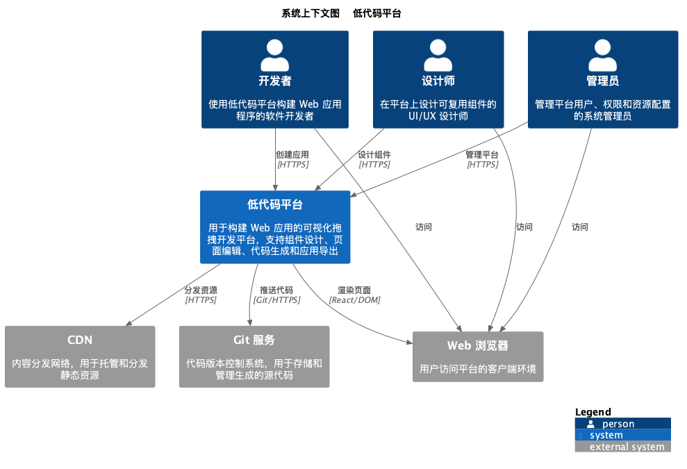
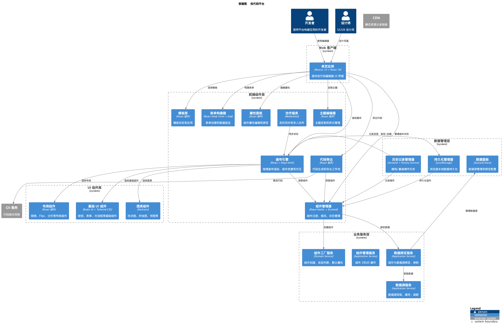
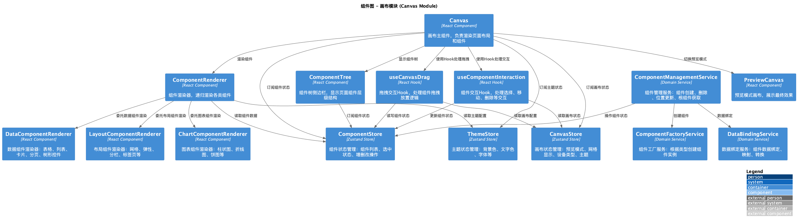

# C4 模型文档

使用 PlantUML 绘制的 C4 架构模型，描述 Explore Lowcode（低代码）的架构。

## 文件

| 文件 | 层级 | 说明 |
| --- | --- | --- |
| `C1-Context.puml` | C1 | 系统上下文（开发者 / 设计师 / Vercel / CDN / Git） |
| `C2-Container.puml` | C2 | 容器图（SPA + 业务域 folders + components/hooks/lib） |
| `C3-Component-Frontend.puml` | C3 | 前端业务域组件图（canvas / component / template / … colocated） |
| `C4-Deployment.puml` | C4 | 本地开发（`pnpm dev` → `:3000`） |
| `C4-Deployment-Production.puml` | C4 | 生产部署（Vercel） |

---

## C1 — 系统上下文图



---

## C2 — 容器图



> 业务域目录调整后 PNG 可能过期 — 可用 PlantUML 从 `.puml` 重新生成。

---

## C3 — 前端组件图



> 业务域目录调整后 PNG 可能过期 — 可用 PlantUML 从 `.puml` 重新生成。

---

## C4 — 部署图

本地与生产部署源文件：`C4-Deployment.puml`、`C4-Deployment-Production.puml`。重新生成 PNG 后放入 `png/`。

---

## 技术栈

| 层级 | 技术 |
| --- | --- |
| 运行时 | Next.js 16 + React 19 + TypeScript |
| UI | Radix UI + Tailwind CSS |
| 拖拽 | React DnD |
| 状态 | Zustand |
| 图表 | Recharts |
| 表单 | React Hook Form + Zod |
| 架构 | Business-domain folders（`src/{domain}` + `components` / `hooks` / `lib`） |
| 持久化 | Browser LocalStorage |
| 部署 | Vercel（推荐）；自托管 `pnpm build && pnpm start` |

---

## 重新生成 PNG

```bash
cd docs/developer/c4-model
plantuml -o png *.puml
# 或
docker run --rm -v "$PWD":/data plantuml/plantuml -o png /data/*.puml
```

---

## 关联文档

- [Glossary](../../Glossary.md)
- [QUICKSTART](../QUICKSTART.md)
- [User Story Map](../../product-owner/User-Story-Map.md)
