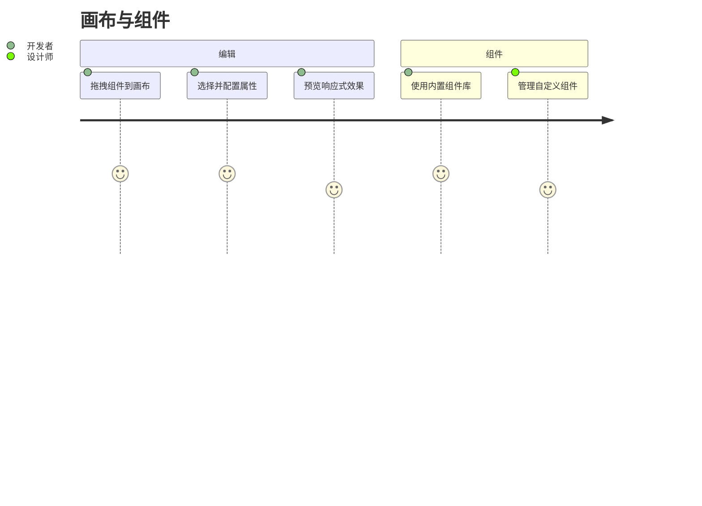
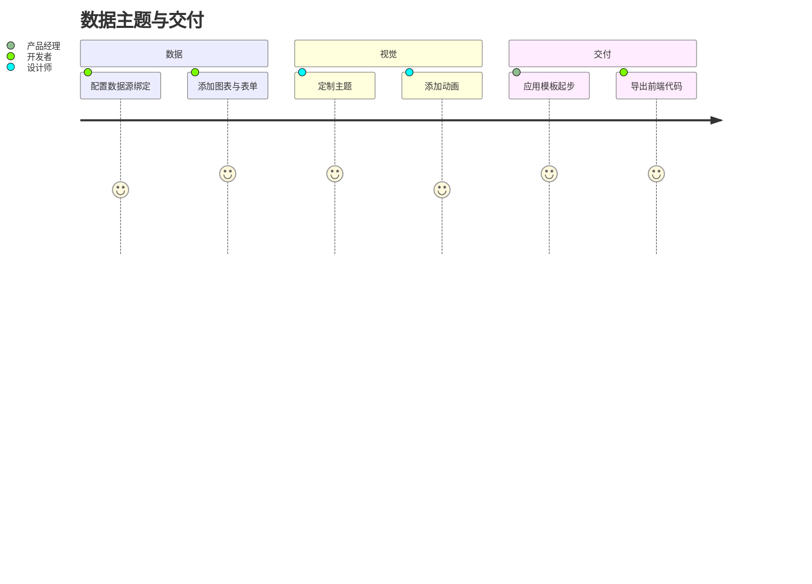

# 用户故事地图

> 格式：Jeff Patton 故事地图 + Mermaid journey + GWT（Epic 分文件）。  
> 故事正文与验收标准见 [user-stories/](./user-stories/)；本页只做索引，避免双源。

## 用户画像

| 角色 | 说明 |
|------|------|
| 开发者 | 拖拽构建页面、绑定数据、导出可部署代码 |
| 设计师 | 定制主题、动画、模板与可复用组件外观 |
| 产品经理 | 用模板快速搭原型并评审交互 |
| 协作者 | 多人同时编辑同一页面（规划） |
| 平台管理员 | 管理组件库与权限（规划） |

## 旅程总览

### 画布编辑与组件

### 数据、主题与交付

---

## Backbone 故事地图

### 已交付

| 画布编辑 | 组件库 | 数据与图表 | 主题与动画 | 模板与导出 |
|----------|--------|------------|------------|------------|
| [US-01](./user-stories/E1-canvas-editor.md#us-01-拖拽构建页面) 拖拽构建 | [US-04](./user-stories/E2-component-library.md#us-04-内置组件库) 内置组件 | [US-07](./user-stories/E3-data-charts.md#us-07-数据源与绑定) 数据绑定 | [US-10](./user-stories/E4-theme-animation.md#us-10-主题编辑) 主题 | [US-12](./user-stories/E5-templates-export.md#us-12-模板库) 模板库 |
| [US-02](./user-stories/E1-canvas-editor.md#us-02-属性配置) 属性配置 | [US-05](./user-stories/E2-component-library.md#us-05-自定义组件) 自定义组件 | [US-08](./user-stories/E3-data-charts.md#us-08-图表组件) 图表 | [US-11](./user-stories/E4-theme-animation.md#us-11-动画编辑) 动画 | [US-13](./user-stories/E5-templates-export.md#us-13-代码导出) 代码导出 |
| [US-03](./user-stories/E1-canvas-editor.md#us-03-预览与撤销重做) 预览/撤销 | [US-06](./user-stories/E2-component-library.md#us-06-组件分组与树) 分组与树 | [US-09](./user-stories/E3-data-charts.md#us-09-表单构建器) 表单 | | |

### 进行中 / 规划中

| 协作与平台 |
|------------|
| [US-14](./user-stories/E6-collaboration-future.md#us-14-实时协作编辑) 实时协作 |
| [US-15](./user-stories/E6-collaboration-future.md#us-15-项目版本管理) 版本管理 |
| [US-16](./user-stories/E6-collaboration-future.md#us-16-数据库连接) 数据库连接 |
| [US-17](./user-stories/E6-collaboration-future.md#us-17-移动端组件库) 移动端组件 |

---

## Epic 索引

| Epic | 主题 | 故事 | 状态 |
|------|------|------|------|
| [E1](./user-stories/E1-canvas-editor.md) | 画布与可视化编辑 | US-01 – US-03 | 已实现 |
| [E2](./user-stories/E2-component-library.md) | 组件库 | US-04 – US-06 | 已实现 |
| [E3](./user-stories/E3-data-charts.md) | 数据、图表与表单 | US-07 – US-09 | 已实现 |
| [E4](./user-stories/E4-theme-animation.md) | 主题与动画 | US-10 – US-11 | 已实现 |
| [E5](./user-stories/E5-templates-export.md) | 模板与代码导出 | US-12 – US-13 | 已实现 |
| [E6](./user-stories/E6-collaboration-future.md) | 协作与后续能力 | US-14 – US-17 | 规划中 |

---

## 关联文档

- [Glossary](../Glossary.md)
- [QUICKSTART](../developer/QUICKSTART.md)
- [C4 Model](../developer/c4-model/README.md)
