# 系统设计文档

## 概述

本文档详细描述了 Felix 低代码平台的系统设计，包括架构图、类图、时序图等 UML 图表，帮助开发者深入理解系统的设计思路和实现细节。

## 系统架构图

### 整体架构

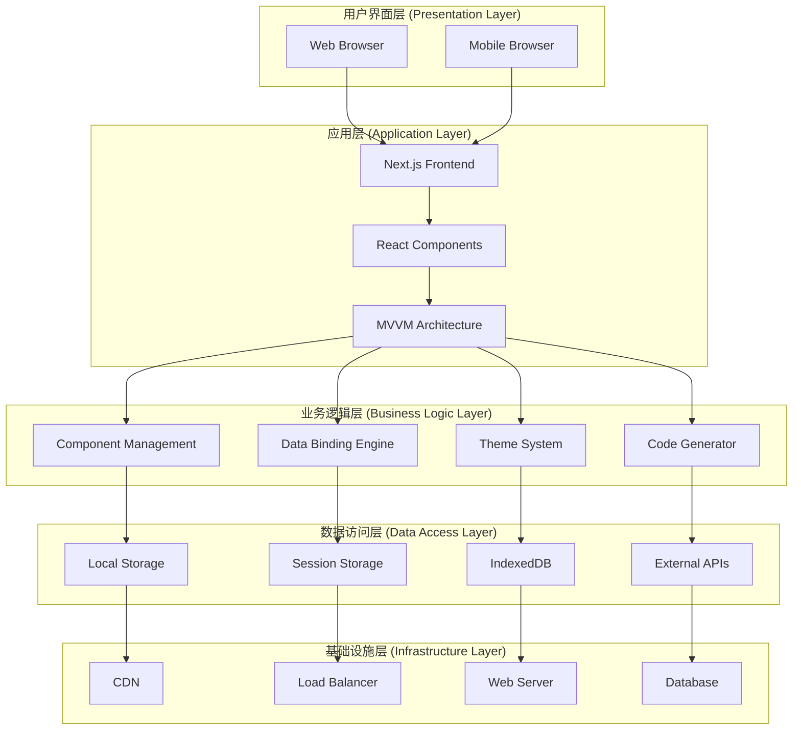
```mermaid
graph TB
    subgraph "用户界面层 (Presentation Layer)"
        A[Web Browser]
        B[Mobile Browser]
    end
    
    subgraph "应用层 (Application Layer)"
        C[Next.js Frontend]
        D[React Components]
        E[MVVM Architecture]
    end
    
    subgraph "业务逻辑层 (Business Logic Layer)"
        F[Component Management]
        G[Data Binding Engine]
        H[Theme System]
        I[Code Generator]
    end
    
    subgraph "数据访问层 (Data Access Layer)"
        J[Local Storage]
        K[Session Storage]
        L[IndexedDB]
        M[External APIs]
    end
    
    subgraph "基础设施层 (Infrastructure Layer)"
        N[CDN]
        O[Load Balancer]
        P[Web Server]
        Q[Database]
    end
    
    A --> C
    B --> C
    C --> D
    D --> E
    E --> F
    E --> G
    E --> H
    E --> I
    F --> J
    G --> K
    H --> L
    I --> M
    J --> N
    K --> O
    L --> P
    M --> Q
```

### MVVM 架构详图

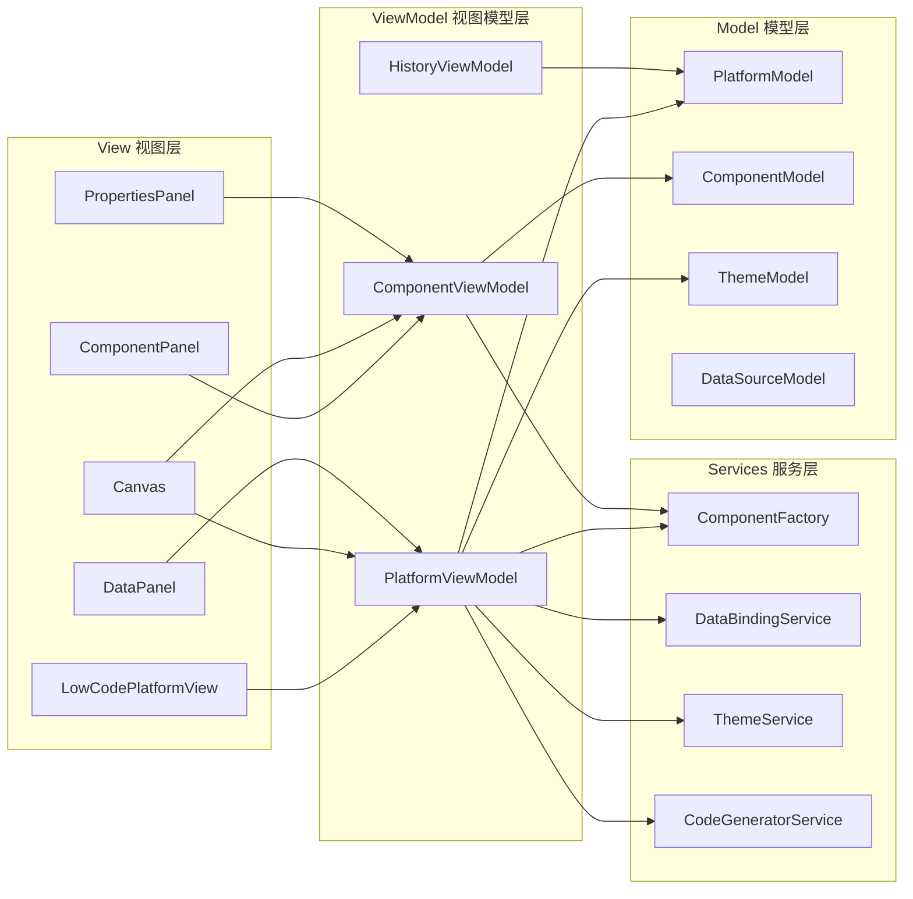
```mermaid
graph LR
    subgraph "View 视图层"
        V1[LowCodePlatformView]
        V2[ComponentPanel]
        V3[Canvas]
        V4[PropertiesPanel]
        V5[DataPanel]
    end
    
    subgraph "ViewModel 视图模型层"
        VM1[PlatformViewModel]
        VM2[ComponentViewModel]
        VM3[HistoryViewModel]
    end
    
    subgraph "Model 模型层"
        M1[PlatformModel]
        M2[ComponentModel]
        M3[ThemeModel]
        M4[DataSourceModel]
    end
    
    subgraph "Services 服务层"
        S1[ComponentFactory]
        S2[DataBindingService]
        S3[ThemeService]
        S4[CodeGeneratorService]
    end
    
    V1 --> VM1
    V2 --> VM2
    V3 --> VM1
    V3 --> VM2
    V4 --> VM2
    V5 --> VM1
    
    VM1 --> M1
    VM1 --> M3
    VM2 --> M2
    VM3 --> M1
    
    VM1 --> S1
    VM1 --> S2
    VM1 --> S3
    VM1 --> S4
    VM2 --> S1
```

## 类图设计

### 核心模型类图

```mermaid
classDiagram
    class PlatformModel {
        +components: ComponentModel[]
        +selectedComponentId: string
        +activeTab: string
        +previewMode: boolean
        +viewport: ViewportModel
        +projectName: string
        +theme: ThemeModel
        +dataSources: DataSourceModel[]
        +customComponents: ComponentModel[]
    }
    
    class ComponentModel {
        +id: string
        +type: string
        +name: string
        +position: Position
        +properties: ComponentProperties
        +children: ComponentModel[]
        +parentId: string
        +dataSource: string
        +dataMapping: Record~string, string~
        +clone(): ComponentModel
        +updateProperties(props: Partial~ComponentProperties~): void
        +addChild(child: ComponentModel): void
        +removeChild(childId: string): void
    }
    
    class ThemeModel {
        +primaryColor: string
        +secondaryColor: string
        +backgroundColor: string
        +textColor: string
        +fontFamily: string
        +borderRadius: string
        +spacing: string
        +apply(): void
        +reset(): void
    }
    
    class DataSourceModel {
        +id: string
        +name: string
        +type: DataSourceType
        +config: DataSourceConfig
        +schema: DataSchema
        +status: ConnectionStatus
        +connect(): Promise~void~
        +disconnect(): void
        +fetchData(): Promise~any~
    }
    
    class ViewportModel {
        +width: number
        +height: number
        +device: DeviceType
        +setSize(width: number, height: number): void
        +setDevice(device: DeviceType): void
    }
    
    PlatformModel ||--o{ ComponentModel : contains
    PlatformModel ||--|| ThemeModel : has
    PlatformModel ||--|| ViewportModel : has
    PlatformModel ||--o{ DataSourceModel : manages
    ComponentModel ||--o{ ComponentModel : children
```

### 视图模型类图

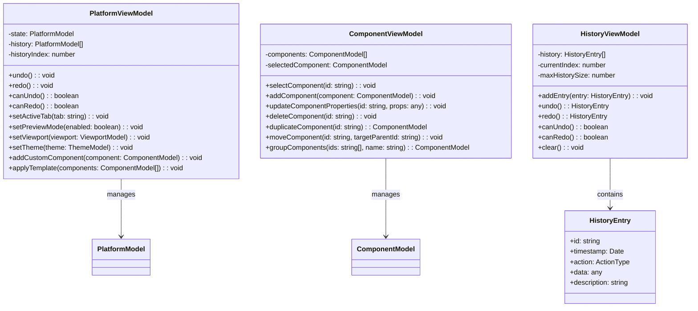
```mermaid
classDiagram
    class PlatformViewModel {
        -state: PlatformModel
        -history: PlatformModel[]
        -historyIndex: number
        +undo(): void
        +redo(): void
        +canUndo(): boolean
        +canRedo(): boolean
        +setActiveTab(tab: string): void
        +setPreviewMode(enabled: boolean): void
        +setViewport(viewport: ViewportModel): void
        +setTheme(theme: ThemeModel): void
        +addCustomComponent(component: ComponentModel): void
        +applyTemplate(components: ComponentModel[]): void
    }
    
    class ComponentViewModel {
        -components: ComponentModel[]
        -selectedComponent: ComponentModel
        +selectComponent(id: string): void
        +addComponent(component: ComponentModel): void
        +updateComponentProperties(id: string, props: any): void
        +deleteComponent(id: string): void
        +duplicateComponent(id: string): ComponentModel
        +moveComponent(id: string, targetParentId: string): void
        +groupComponents(ids: string[], name: string): ComponentModel
    }
    
    class HistoryViewModel {
        -history: HistoryEntry[]
        -currentIndex: number
        -maxHistorySize: number
        +addEntry(entry: HistoryEntry): void
        +undo(): HistoryEntry
        +redo(): HistoryEntry
        +canUndo(): boolean
        +canRedo(): boolean
        +clear(): void
    }
    
    class HistoryEntry {
        +id: string
        +timestamp: Date
        +action: ActionType
        +data: any
        +description: string
    }
    
    PlatformViewModel --> PlatformModel : manages
    ComponentViewModel --> ComponentModel : manages
    HistoryViewModel --> HistoryEntry : contains
```

### 组件系统类图

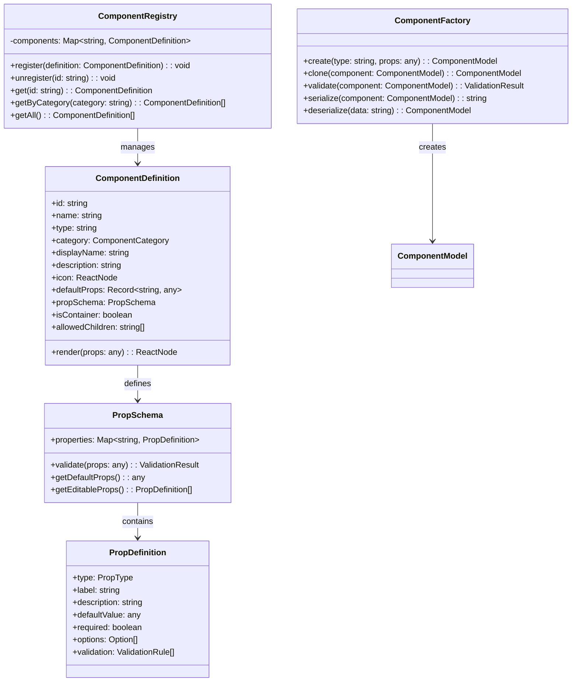
```mermaid
classDiagram
    class ComponentDefinition {
        +id: string
        +name: string
        +type: string
        +category: ComponentCategory
        +displayName: string
        +description: string
        +icon: ReactNode
        +defaultProps: Record~string, any~
        +propSchema: PropSchema
        +isContainer: boolean
        +allowedChildren: string[]
        +render(props: any): ReactNode
    }
    
    class ComponentRegistry {
        -components: Map~string, ComponentDefinition~
        +register(definition: ComponentDefinition): void
        +unregister(id: string): void
        +get(id: string): ComponentDefinition
        +getByCategory(category: string): ComponentDefinition[]
        +getAll(): ComponentDefinition[]
    }
    
    class ComponentFactory {
        +create(type: string, props: any): ComponentModel
        +clone(component: ComponentModel): ComponentModel
        +validate(component: ComponentModel): ValidationResult
        +serialize(component: ComponentModel): string
        +deserialize(data: string): ComponentModel
    }
    
    class PropSchema {
        +properties: Map~string, PropDefinition~
        +validate(props: any): ValidationResult
        +getDefaultProps(): any
        +getEditableProps(): PropDefinition[]
    }
    
    class PropDefinition {
        +type: PropType
        +label: string
        +description: string
        +defaultValue: any
        +required: boolean
        +options: Option[]
        +validation: ValidationRule[]
    }
    
    ComponentRegistry --> ComponentDefinition : manages
    ComponentFactory --> ComponentModel : creates
    ComponentDefinition --> PropSchema : defines
    PropSchema --> PropDefinition : contains
```

## 时序图

### 组件拖拽添加流程

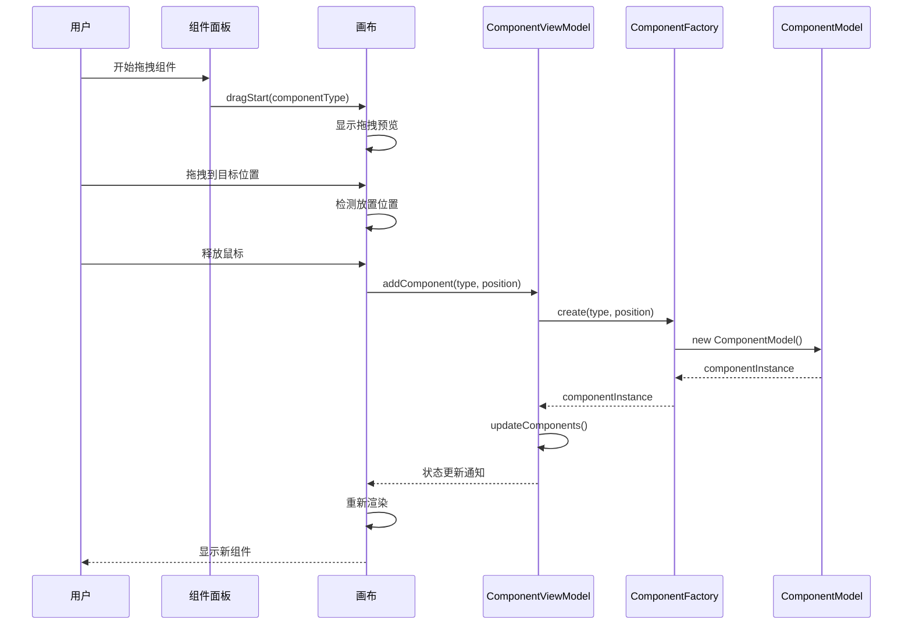
```mermaid
sequenceDiagram
    participant User as 用户
    participant Panel as 组件面板
    participant Canvas as 画布
    participant VM as ComponentViewModel
    participant Factory as ComponentFactory
    participant Model as ComponentModel
    
    User->>Panel: 开始拖拽组件
    Panel->>Canvas: dragStart(componentType)
    Canvas->>Canvas: 显示拖拽预览
    User->>Canvas: 拖拽到目标位置
    Canvas->>Canvas: 检测放置位置
    User->>Canvas: 释放鼠标
    Canvas->>VM: addComponent(type, position)
    VM->>Factory: create(type, position)
    Factory->>Model: new ComponentModel()
    Model-->>Factory: componentInstance
    Factory-->>VM: componentInstance
    VM->>VM: updateComponents()
    VM-->>Canvas: 状态更新通知
    Canvas->>Canvas: 重新渲染
    Canvas-->>User: 显示新组件
```

### 属性编辑流程

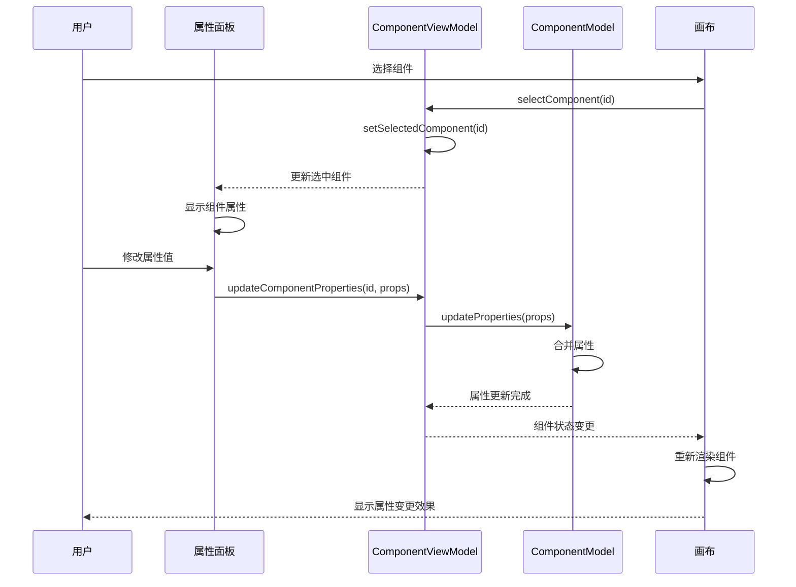
```mermaid
sequenceDiagram
    participant User as 用户
    participant Props as 属性面板
    participant VM as ComponentViewModel
    participant Model as ComponentModel
    participant Canvas as 画布
    
    User->>Canvas: 选择组件
    Canvas->>VM: selectComponent(id)
    VM->>VM: setSelectedComponent(id)
    VM-->>Props: 更新选中组件
    Props->>Props: 显示组件属性
    User->>Props: 修改属性值
    Props->>VM: updateComponentProperties(id, props)
    VM->>Model: updateProperties(props)
    Model->>Model: 合并属性
    Model-->>VM: 属性更新完成
    VM-->>Canvas: 组件状态变更
    Canvas->>Canvas: 重新渲染组件
    Canvas-->>User: 显示属性变更效果
```

### 数据绑定流程

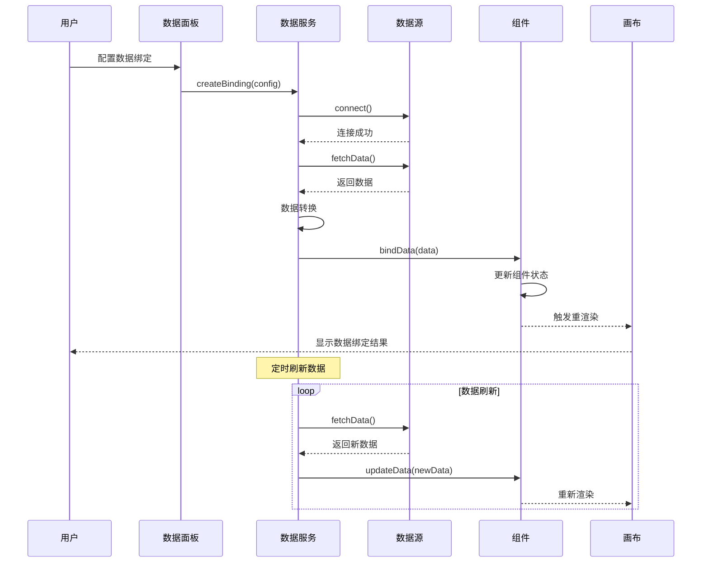
```mermaid
sequenceDiagram
    participant User as 用户
    participant DataPanel as 数据面板
    participant DataService as 数据服务
    participant DataSource as 数据源
    participant Component as 组件
    participant Canvas as 画布
    
    User->>DataPanel: 配置数据绑定
    DataPanel->>DataService: createBinding(config)
    DataService->>DataSource: connect()
    DataSource-->>DataService: 连接成功
    DataService->>DataSource: fetchData()
    DataSource-->>DataService: 返回数据
    DataService->>DataService: 数据转换
    DataService->>Component: bindData(data)
    Component->>Component: 更新组件状态
    Component-->>Canvas: 触发重渲染
    Canvas-->>User: 显示数据绑定结果
    
    Note over DataService: 定时刷新数据
    loop 数据刷新
        DataService->>DataSource: fetchData()
        DataSource-->>DataService: 返回新数据
        DataService->>Component: updateData(newData)
        Component-->>Canvas: 重新渲染
    end
```

### 代码生成流程

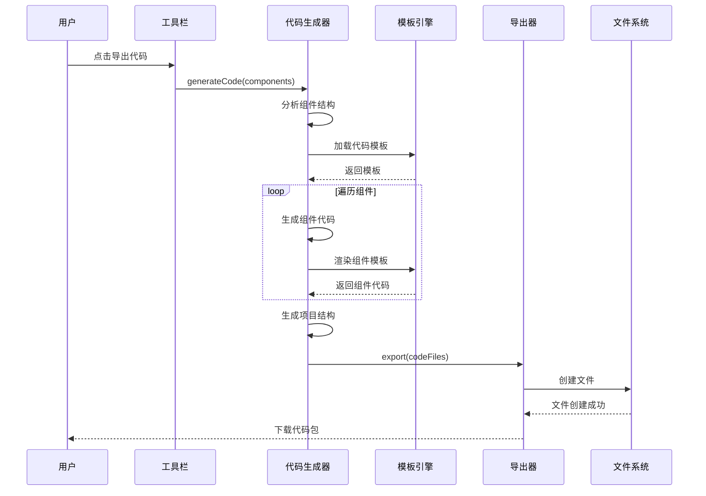
```mermaid
sequenceDiagram
    participant User as 用户
    participant Toolbar as 工具栏
    participant Generator as 代码生成器
    participant Template as 模板引擎
    participant Exporter as 导出器
    participant FileSystem as 文件系统
    
    User->>Toolbar: 点击导出代码
    Toolbar->>Generator: generateCode(components)
    Generator->>Generator: 分析组件结构
    Generator->>Template: 加载代码模板
    Template-->>Generator: 返回模板
    
    loop 遍历组件
        Generator->>Generator: 生成组件代码
        Generator->>Template: 渲染组件模板
        Template-->>Generator: 返回组件代码
    end
    
    Generator->>Generator: 生成项目结构
    Generator->>Exporter: export(codeFiles)
    Exporter->>FileSystem: 创建文件
    FileSystem-->>Exporter: 文件创建成功
    Exporter-->>User: 下载代码包
```

## 状态图

### 组件生命周期状态图

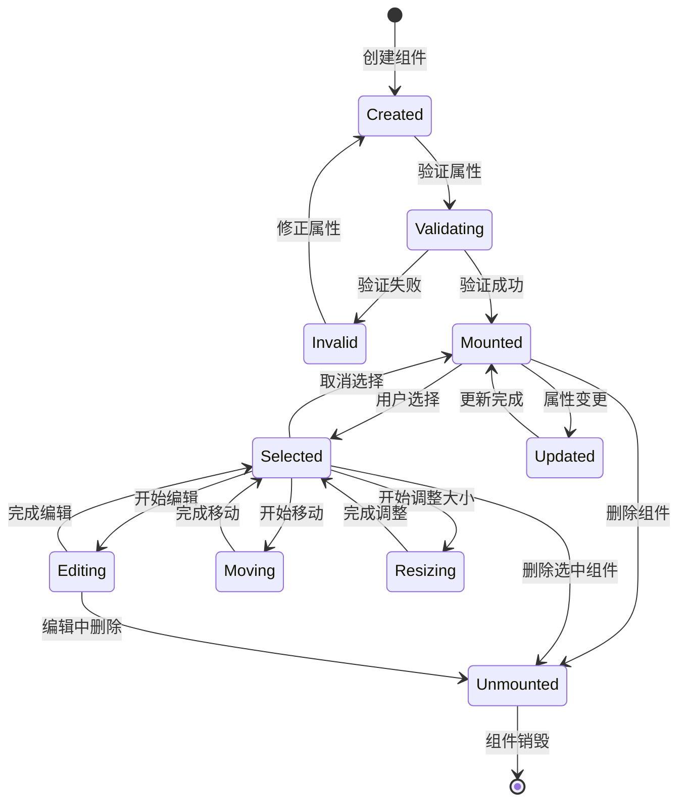
```mermaid
stateDiagram-v2
    [*] --> Created: 创建组件
    Created --> Validating: 验证属性
    Validating --> Invalid: 验证失败
    Validating --> Mounted: 验证成功
    Invalid --> Created: 修正属性
    
    Mounted --> Selected: 用户选择
    Mounted --> Updated: 属性变更
    Selected --> Editing: 开始编辑
    Selected --> Moving: 开始移动
    Selected --> Resizing: 开始调整大小
    
    Editing --> Selected: 完成编辑
    Moving --> Selected: 完成移动
    Resizing --> Selected: 完成调整
    
    Updated --> Mounted: 更新完成
    Selected --> Mounted: 取消选择
    
    Mounted --> Unmounted: 删除组件
    Selected --> Unmounted: 删除选中组件
    Editing --> Unmounted: 编辑中删除
    
    Unmounted --> [*]: 组件销毁
```

### 应用状态图

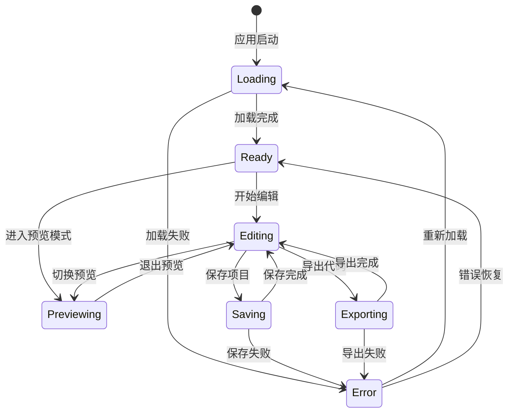
```mermaid
stateDiagram-v2
    [*] --> Loading: 应用启动
    Loading --> Ready: 加载完成
    Loading --> Error: 加载失败
    Error --> Loading: 重新加载
    
    Ready --> Editing: 开始编辑
    Ready --> Previewing: 进入预览模式
    
    Editing --> Saving: 保存项目
    Editing --> Previewing: 切换预览
    Editing --> Exporting: 导出代码
    
    Saving --> Editing: 保存完成
    Saving --> Error: 保存失败
    
    Previewing --> Editing: 退出预览
    
    Exporting --> Editing: 导出完成
    Exporting --> Error: 导出失败
    
    Error --> Ready: 错误恢复
```

## 部署架构图

### 开发环境架构

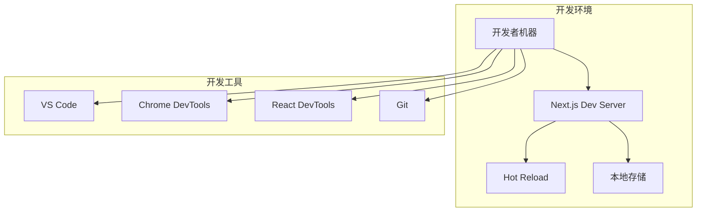
```mermaid
graph TB
    subgraph "开发环境"
        A[开发者机器]
        B[Next.js Dev Server]
        C[Hot Reload]
        D[本地存储]
    end
    
    subgraph "开发工具"
        E[VS Code]
        F[Chrome DevTools]
        G[React DevTools]
        H[Git]
    end
    
    A --> B
    B --> C
    B --> D
    A --> E
    A --> F
    A --> G
    A --> H
```

### 生产环境架构

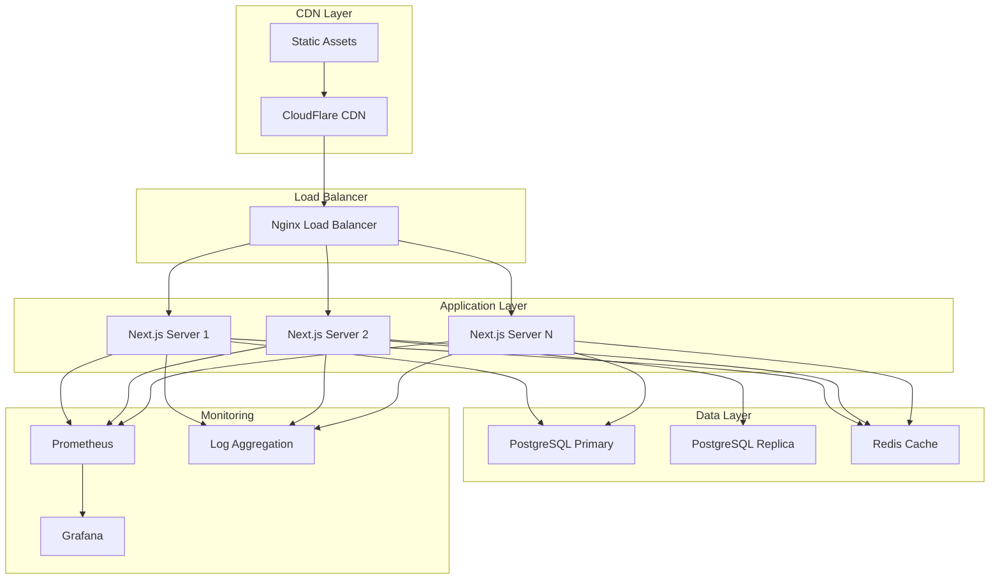
```mermaid
graph TB
    subgraph "CDN Layer"
        A[CloudFlare CDN]
        B[Static Assets]
    end
    
    subgraph "Load Balancer"
        C[Nginx Load Balancer]
    end
    
    subgraph "Application Layer"
        D[Next.js Server 1]
        E[Next.js Server 2]
        F[Next.js Server N]
    end
    
    subgraph "Data Layer"
        G[PostgreSQL Primary]
        H[PostgreSQL Replica]
        I[Redis Cache]
    end
    
    subgraph "Monitoring"
        J[Prometheus]
        K[Grafana]
        L[Log Aggregation]
    end
    
    A --> C
    B --> A
    C --> D
    C --> E
    C --> F
    D --> G
    D --> I
    E --> H
    E --> I
    F --> G
    F --> I
    
    D --> J
    E --> J
    F --> J
    J --> K
    D --> L
    E --> L
    F --> L
```

## 数据流图

### 组件数据流

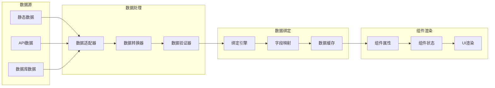
```mermaid
graph LR
    subgraph "数据源"
        A[静态数据]
        B[API数据]
        C[数据库数据]
    end
    
    subgraph "数据处理"
        D[数据适配器]
        E[数据转换器]
        F[数据验证器]
    end
    
    subgraph "数据绑定"
        G[绑定引擎]
        H[字段映射]
        I[数据缓存]
    end
    
    subgraph "组件渲染"
        J[组件属性]
        K[组件状态]
        L[UI渲染]
    end
    
    A --> D
    B --> D
    C --> D
    D --> E
    E --> F
    F --> G
    G --> H
    H --> I
    I --> J
    J --> K
    K --> L
```

### 事件流图

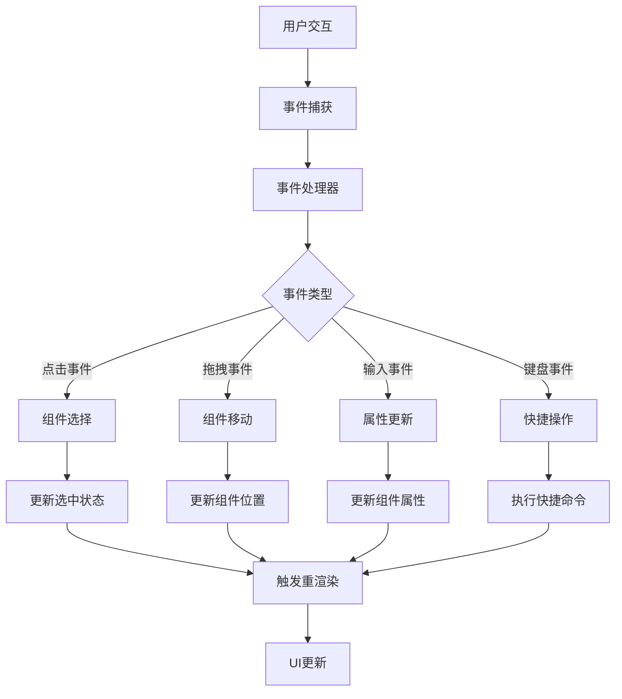
```mermaid
graph TD
    A[用户交互] --> B[事件捕获]
    B --> C[事件处理器]
    C --> D{事件类型}
    
    D -->|点击事件| E[组件选择]
    D -->|拖拽事件| F[组件移动]
    D -->|输入事件| G[属性更新]
    D -->|键盘事件| H[快捷操作]
    
    E --> I[更新选中状态]
    F --> J[更新组件位置]
    G --> K[更新组件属性]
    H --> L[执行快捷命令]
    
    I --> M[触发重渲染]
    J --> M
    K --> M
    L --> M
    
    M --> N[UI更新]
```

## 安全架构图

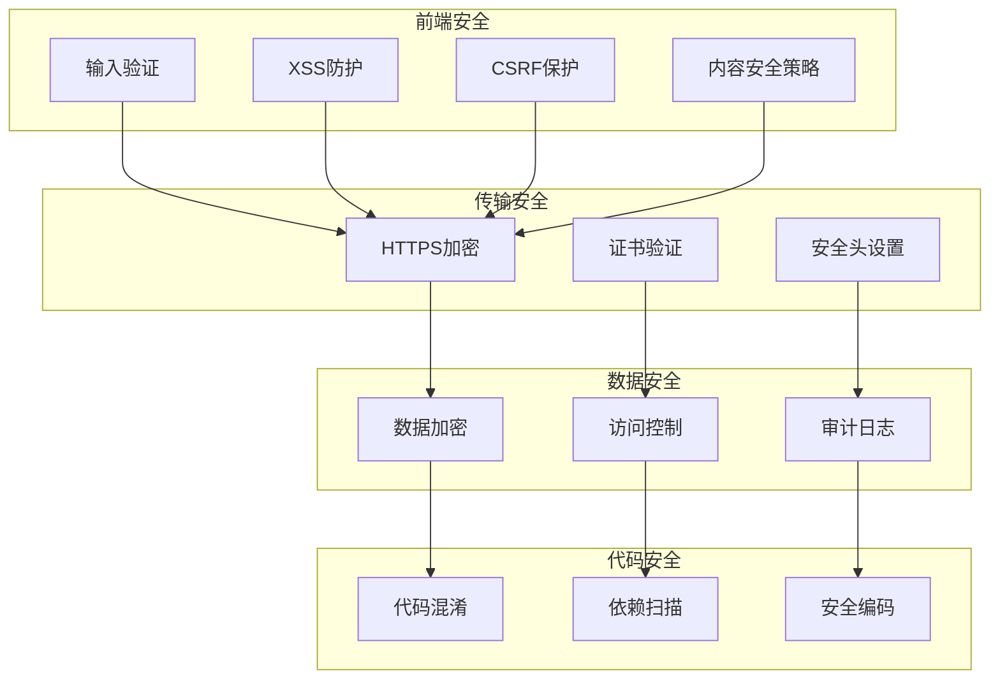
```mermaid
graph TB
    subgraph "前端安全"
        A[输入验证]
        B[XSS防护]
        C[CSRF保护]
        D[内容安全策略]
    end
    
    subgraph "传输安全"
        E[HTTPS加密]
        F[证书验证]
        G[安全头设置]
    end
    
    subgraph "数据安全"
        H[数据加密]
        I[访问控制]
        J[审计日志]
    end
    
    subgraph "代码安全"
        K[代码混淆]
        L[依赖扫描]
        M[安全编码]
    end
    
    A --> E
    B --> E
    C --> E
    D --> E
    E --> H
    F --> I
    G --> J
    H --> K
    I --> L
    J --> M
```

## 性能优化架构

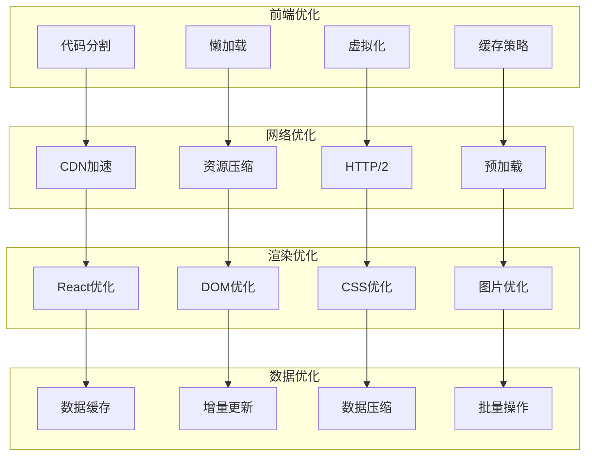
```mermaid
graph TB
    subgraph "前端优化"
        A[代码分割]
        B[懒加载]
        C[虚拟化]
        D[缓存策略]
    end
    
    subgraph "网络优化"
        E[CDN加速]
        F[资源压缩]
        G[HTTP/2]
        H[预加载]
    end
    
    subgraph "渲染优化"
        I[React优化]
        J[DOM优化]
        K[CSS优化]
        L[图片优化]
    end
    
    subgraph "数据优化"
        M[数据缓存]
        N[增量更新]
        O[数据压缩]
        P[批量操作]
    end
    
    A --> E
    B --> F
    C --> G
    D --> H
    E --> I
    F --> J
    G --> K
    H --> L
    I --> M
    J --> N
    K --> O
    L --> P
```

这些 UML 图表全面展示了 Felix 低代码平台的系统设计，包括：

1. **架构图**: 展示系统的整体架构和模块关系
2. **类图**: 详细描述核心类的结构和关系
3. **时序图**: 展示关键业务流程的执行顺序
4. **状态图**: 描述组件和应用的状态变迁
5. **部署图**: 展示不同环境的部署架构
6. **数据流图**: 描述数据在系统中的流动
7. **安全架构图**: 展示安全防护措施
8. **性能优化架构**: 展示性能优化策略

这些图表有助于开发者理解系统的设计思路，为后续的开发和维护提供指导。