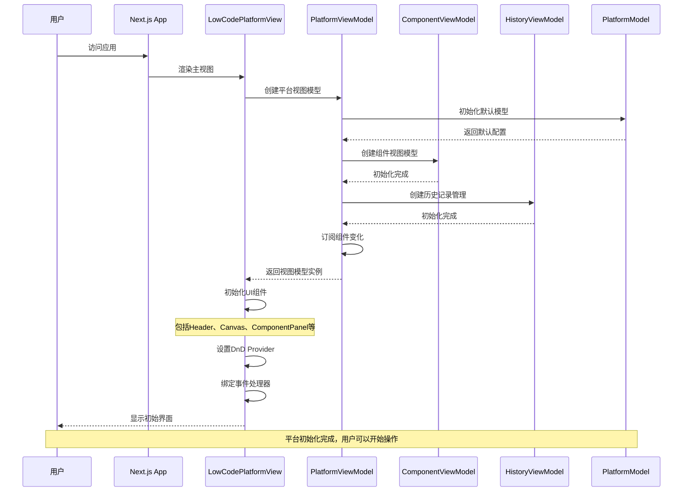

# 平台初始化时序图

## 概述
描述Felix低代码平台启动和初始化的完整流程。

## 时序图

## 关键步骤说明

1. **应用启动**: Next.js应用启动，渲染主视图组件
2. **MVVM初始化**: 创建PlatformViewModel作为核心状态管理器
3. **模型创建**: 初始化PlatformModel，包含默认主题、视口等配置
4. **子模块初始化**: 创建ComponentViewModel和HistoryViewModel
5. **事件订阅**: 建立组件变化监听机制
6. **UI渲染**: 渲染各个UI面板和工具栏
7. **拖拽系统**: 初始化React DnD系统

## 涉及的主要文件

- `src/app/page.tsx` - Next.js页面入口
- `src/mvvm/views/LowCodePlatformView.tsx` - 主视图组件
- `src/mvvm/viewmodels/PlatformViewModel.ts` - 平台视图模型
- `src/mvvm/models/PlatformModel.ts` - 平台数据模型
- `src/mvvm/viewmodels/ComponentViewModel.ts` - 组件视图模型
- `src/mvvm/viewmodels/HistoryViewModel.ts` - 历史记录管理