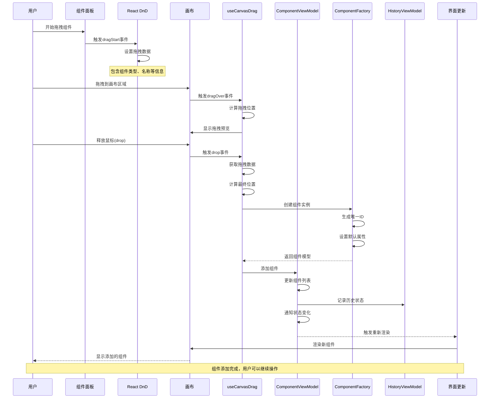

# 组件拖拽添加时序图

## 概述
描述用户从组件面板拖拽组件到画布的完整交互流程。

## 时序图

## 关键步骤说明

1. **拖拽开始**: 用户在组件面板开始拖拽组件
2. **拖拽数据**: React DnD设置拖拽传输的组件信息
3. **拖拽预览**: 画布显示拖拽位置预览效果
4. **位置计算**: 根据鼠标位置计算组件放置坐标
5. **组件创建**: 使用工厂模式创建组件实例
6. **状态更新**: 更新组件列表并记录历史
7. **界面渲染**: 重新渲染画布显示新组件

## 涉及的主要文件

- `src/mvvm/views/components/component-panel.tsx` - 组件面板
- `src/mvvm/views/components/canvas.tsx` - 画布组件
- `src/mvvm/hooks/use-canvas-drag.ts` - 拖拽处理Hook
- `src/mvvm/viewmodels/ComponentViewModel.ts` - 组件状态管理
- `src/mvvm/models/ComponentModel.ts` - 组件数据模型
- `src/mvvm/viewmodels/component-factory.service.ts` - 组件工厂