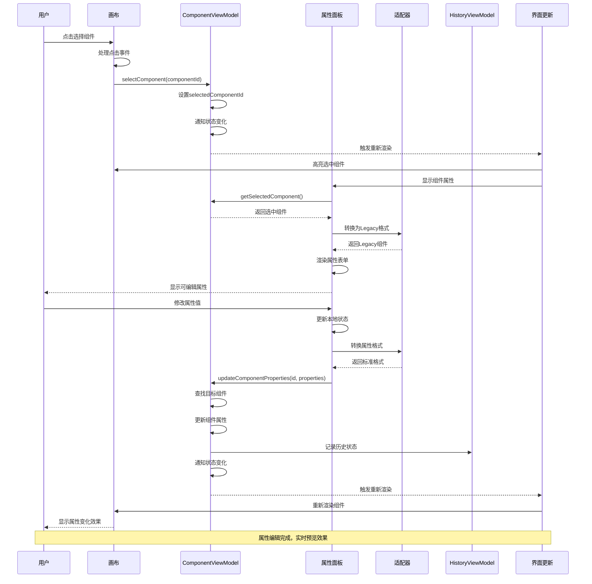

# 组件选择与属性编辑时序图

## 概述
描述用户选择画布中的组件并在属性面板中编辑其属性的完整流程。

## 时序图

## 关键步骤说明

1. **组件选择**: 用户点击画布中的组件进行选择
2. **状态更新**: ComponentViewModel更新选中状态
3. **界面响应**: 画布高亮选中组件，属性面板显示
4. **属性加载**: 属性面板获取并显示组件属性
5. **格式转换**: 使用LegacyAdapter进行数据格式适配
6. **属性编辑**: 用户在属性面板中修改属性值
7. **实时更新**: 属性变化立即反映到画布预览

## 涉及的主要文件

- `src/mvvm/views/components/canvas.tsx` - 画布组件选择
- `src/mvvm/views/components/properties-panel.tsx` - 属性编辑面板
- `src/mvvm/viewmodels/ComponentViewModel.ts` - 组件状态管理
- `src/mvvm/adapters/LegacyAdapter.ts` - 数据格式适配器
- `src/mvvm/hooks/useComponentViewModel.ts` - 组件操作Hook
- `src/mvvm/viewmodels/HistoryViewModel.ts` - 历史记录管理