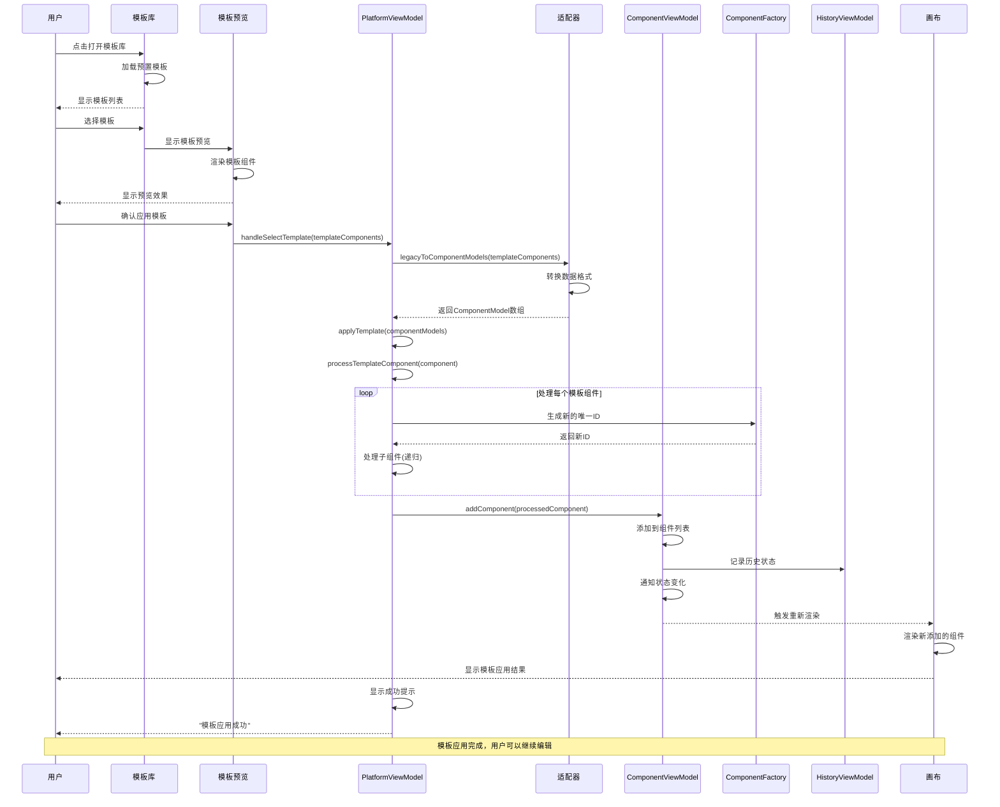

# 模板应用时序图

## 概述
描述用户选择并应用页面模板到画布的完整流程。

## 时序图

## 关键步骤说明

1. **模板浏览**: 用户打开模板库浏览可用模板
2. **模板预览**: 选择模板后显示预览效果
3. **确认应用**: 用户确认应用选中的模板
4. **数据转换**: 将Legacy格式转换为ComponentModel
5. **组件处理**: 为模板组件生成新的唯一ID
6. **递归处理**: 处理嵌套的子组件结构
7. **状态更新**: 添加组件到画布并记录历史
8. **界面更新**: 重新渲染画布显示模板内容

## 涉及的主要文件

- `src/mvvm/views/components/template-gallery.tsx` - 模板库组件
- `src/mvvm/views/components/template-preview.tsx` - 模板预览
- `src/mvvm/viewmodels/PlatformViewModel.ts` - 平台状态管理
- `src/mvvm/adapters/LegacyAdapter.ts` - 数据格式适配
- `src/mvvm/viewmodels/ComponentViewModel.ts` - 组件管理
- `src/mvvm/models/ComponentModel.ts` - 组件数据模型