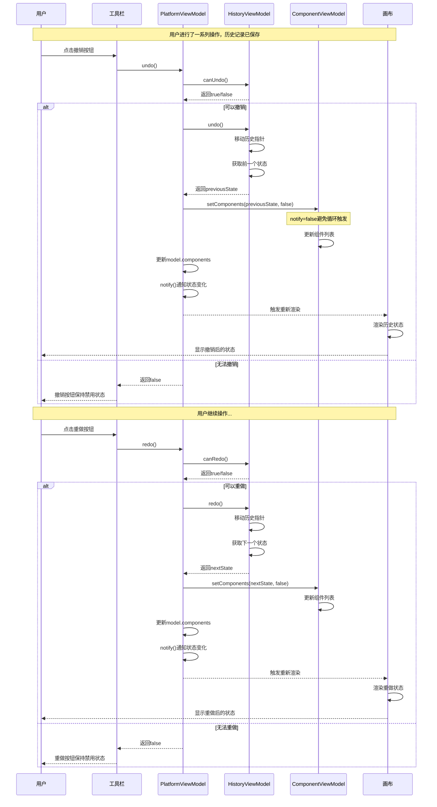
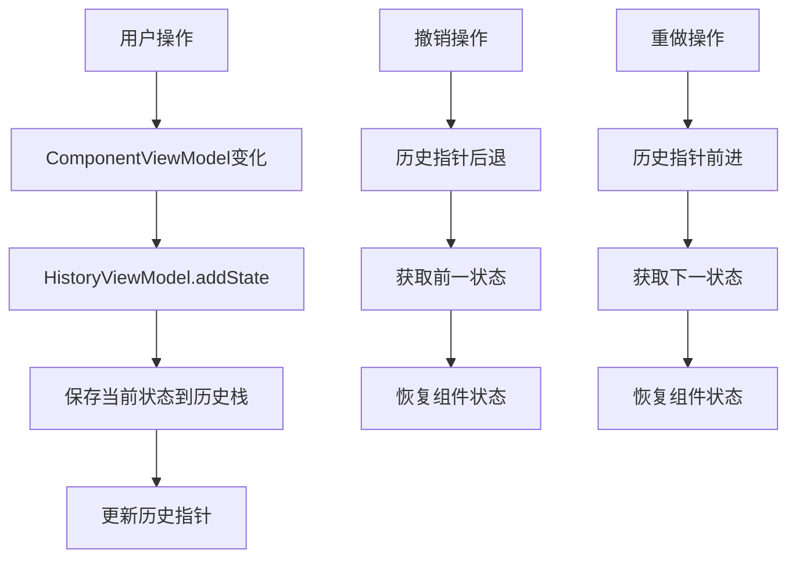

# 撤销重做操作时序图

## 概述
描述用户执行撤销(Undo)和重做(Redo)操作的完整流程。

## 时序图

## 关键步骤说明

1. **撤销检查**: 检查是否有可撤销的历史记录
2. **状态回退**: 从历史记录中获取前一个状态
3. **组件更新**: 更新ComponentViewModel中的组件列表
4. **避免循环**: 设置notify=false避免触发新的历史记录
5. **界面更新**: 重新渲染画布显示历史状态
6. **重做检查**: 检查是否有可重做的历史记录
7. **状态前进**: 从历史记录中获取下一个状态

## 历史记录管理机制

## 涉及的主要文件

- `src/mvvm/views/LowCodePlatformView.tsx` - 撤销重做按钮
- `src/mvvm/viewmodels/PlatformViewModel.ts` - 撤销重做逻辑
- `src/mvvm/viewmodels/HistoryViewModel.ts` - 历史记录管理
- `src/mvvm/viewmodels/ComponentViewModel.ts` - 组件状态管理