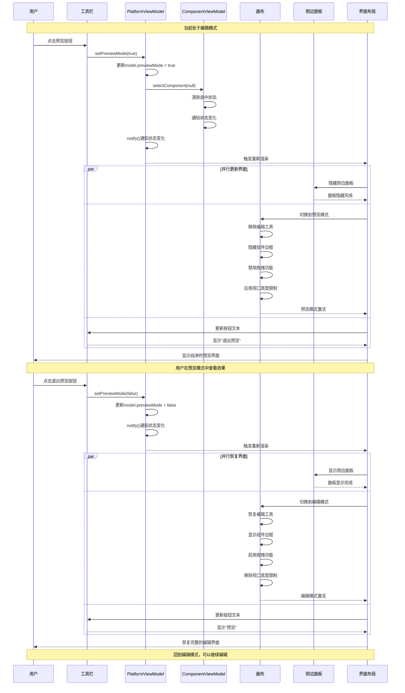
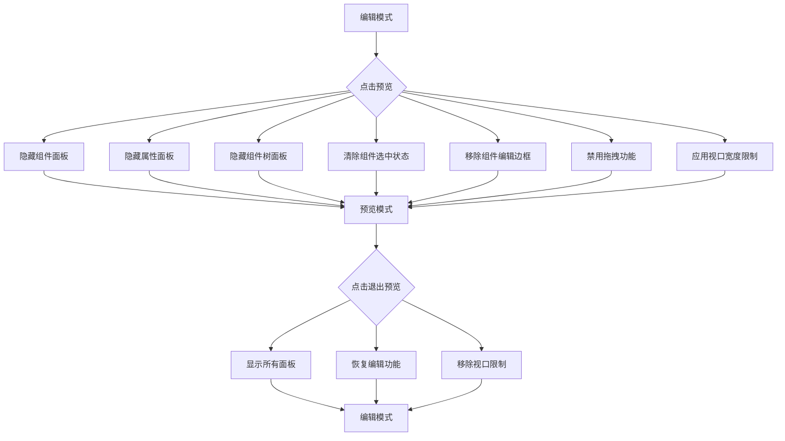

# 预览模式切换时序图

## 概述
描述用户在编辑模式和预览模式之间切换的完整流程。

## 时序图

## 预览模式界面变化

## 关键步骤说明

1. **预览切换**: 用户点击预览按钮触发模式切换
2. **状态更新**: PlatformViewModel更新预览模式状态
3. **选中清除**: 自动清除当前选中的组件
4. **界面调整**: 并行执行多个界面元素的显示/隐藏
5. **功能禁用**: 在预览模式下禁用编辑相关功能
6. **视口限制**: 应用响应式视口宽度限制
7. **模式恢复**: 退出预览时恢复所有编辑功能

## 涉及的主要文件

- `src/mvvm/views/LowCodePlatformView.tsx` - 主视图布局控制
- `src/mvvm/viewmodels/PlatformViewModel.ts` - 预览模式状态管理
- `src/mvvm/views/components/canvas.tsx` - 画布预览模式处理
- `src/mvvm/views/components/header.tsx` - 预览按钮交互