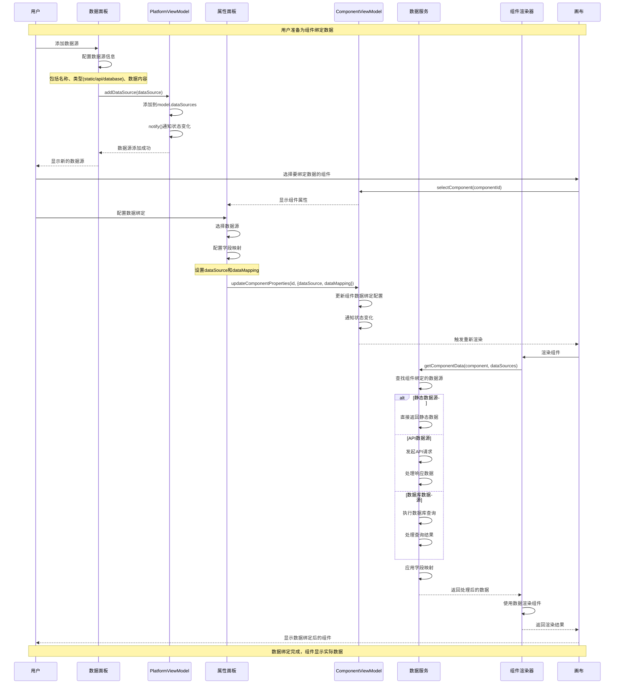
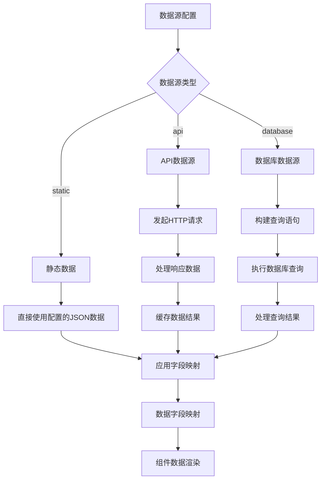
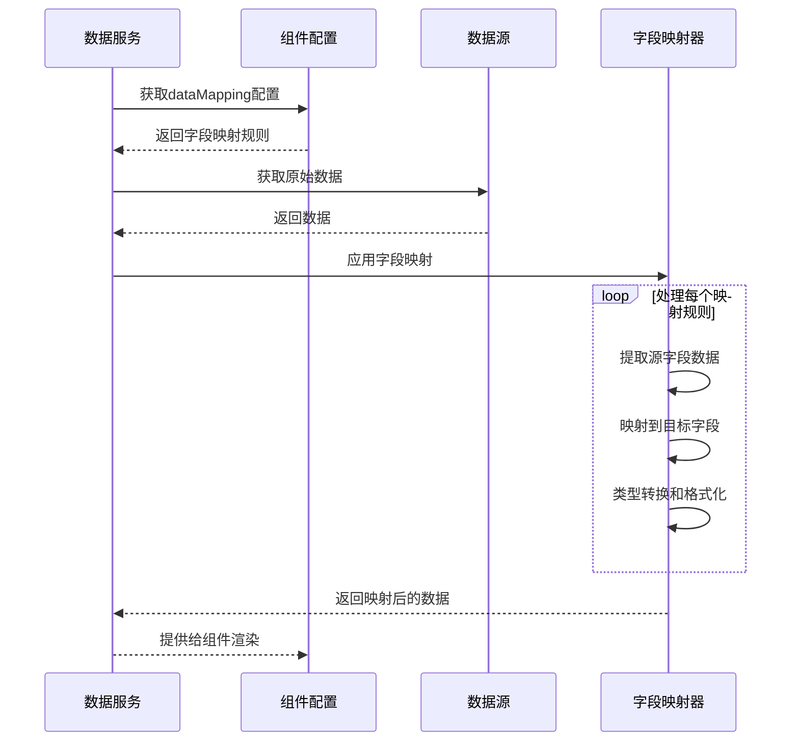

# 数据绑定流程时序图

## 概述
描述组件与数据源绑定以及数据渲染的完整流程。

## 时序图

## 数据源类型处理流程

## 字段映射机制

## 关键步骤说明

1. **数据源管理**: 用户在数据面板中添加和配置数据源
2. **组件选择**: 选择需要绑定数据的组件
3. **绑定配置**: 在属性面板中配置数据源和字段映射
4. **数据获取**: 根据数据源类型获取数据
5. **字段映射**: 将数据源字段映射到组件属性
6. **组件渲染**: 使用映射后的数据渲染组件

## 涉及的主要文件

- `src/mvvm/views/components/data-panel.tsx` - 数据源管理面板
- `src/mvvm/views/components/properties-panel.tsx` - 数据绑定配置
- `src/mvvm/viewmodels/PlatformViewModel.ts` - 数据源状态管理
- `src/mvvm/viewmodels/component-management.service.ts` - 数据获取服务
- `src/mvvm/views/components/component-renderer/` - 组件渲染器