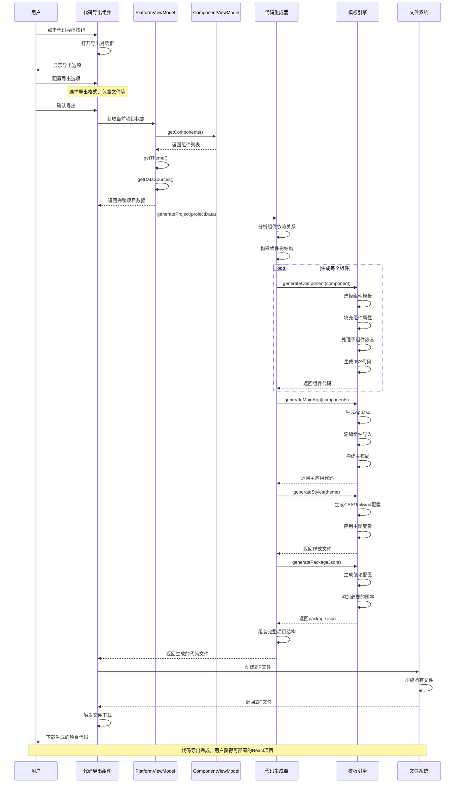
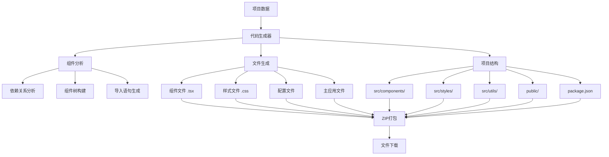

# 代码导出流程时序图

## 概述
描述用户导出生成的React代码的完整流程。

## 时序图



## 代码生成结构



## 组件代码生成模板

```typescript
// 组件生成示例
const componentTemplate = `
import React from 'react';
{{#if hasStyles}}
import './{{componentName}}.css';
{{/if}}
{{#each imports}}
import { {{name}} } from '{{path}}';
{{/each}}

interface {{componentName}}Props {
  {{#each props}}
  {{name}}?: {{type}};
  {{/each}}
}

export const {{componentName}}: React.FC<{{componentName}}Props> = ({
  {{#each props}}
  {{name}}{{#if defaultValue}} = {{defaultValue}}{{/if}},
  {{/each}}
}) => {
  return (
    <{{tagName}}
      {{#each attributes}}
      {{name}}={{value}}
      {{/each}}
    >
      {{#if hasChildren}}
      {{#each children}}
      {{{childComponent}}}
      {{/each}}
      {{else}}
      {{{content}}}
      {{/if}}
    </{{tagName}}>
  );
};
`;
```

## 关键步骤说明

1. **导出配置**: 用户选择导出选项和格式
2. **数据收集**: 获取当前项目的完整状态数据
3. **依赖分析**: 分析组件间的依赖关系
4. **代码生成**: 使用模板引擎生成各类文件
5. **项目结构**: 构建标准的React项目结构
6. **文件打包**: 将所有文件打包成ZIP格式
7. **文件下载**: 提供给用户下载

## 涉及的主要文件

- `src/mvvm/views/components/code-export.tsx` - 代码导出界面
- `src/mvvm/viewmodels/PlatformViewModel.ts` - 项目数据获取
- 代码生成器相关服务 (需要实现)
- 组件模板文件 (需要创建)