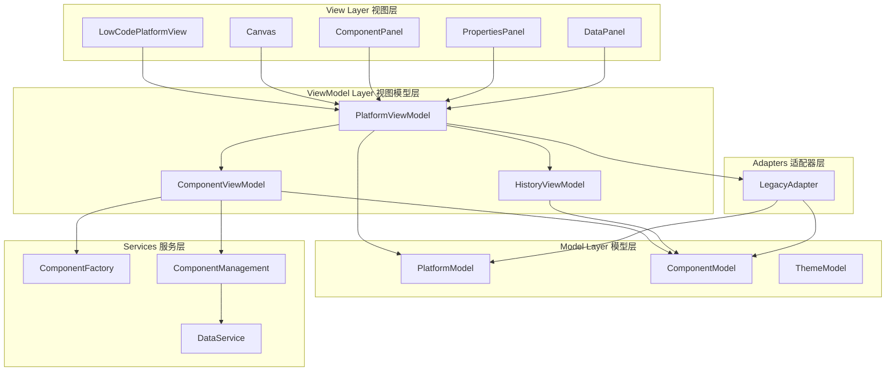

# Felix 低代码平台 - 工作流时序图

本目录包含了Felix低代码平台各个核心功能的时序图文档，详细描述了用户操作和系统响应的完整流程。

## 📋 时序图列表

### 1. [平台初始化](./01-platform-initialization.md)
- **描述**: 平台启动和MVVM架构初始化流程
- **关键组件**: PlatformViewModel, ComponentViewModel, HistoryViewModel
- **主要流程**: 应用启动 → MVVM初始化 → UI渲染 → 拖拽系统设置

### 2. [组件拖拽添加](./02-component-drag-drop.md)
- **描述**: 从组件面板拖拽组件到画布的交互流程
- **关键组件**: ComponentPanel, Canvas, React DnD, ComponentFactory
- **主要流程**: 拖拽开始 → 位置计算 → 组件创建 → 状态更新 → 界面渲染

### 3. [组件选择与属性编辑](./03-component-selection-editing.md)
- **描述**: 选择组件并在属性面板中编辑属性的流程
- **关键组件**: Canvas, PropertiesPanel, ComponentViewModel, LegacyAdapter
- **主要流程**: 组件选择 → 属性加载 → 属性编辑 → 实时预览

### 4. [模板应用](./04-template-application.md)
- **描述**: 选择并应用页面模板到画布的流程
- **关键组件**: TemplateGallery, PlatformViewModel, ComponentFactory
- **主要流程**: 模板浏览 → 预览确认 → 数据转换 → 组件生成 → 画布更新

### 5. [撤销重做操作](./05-undo-redo-operations.md)
- **描述**: 历史记录管理和撤销重做功能的实现
- **关键组件**: HistoryViewModel, PlatformViewModel, ComponentViewModel
- **主要流程**: 历史记录 → 状态回退/前进 → 组件恢复 → 界面更新

### 6. [预览模式切换](./06-preview-mode-toggle.md)
- **描述**: 编辑模式和预览模式之间的切换流程
- **关键组件**: PlatformViewModel, Canvas, 侧边面板
- **主要流程**: 模式切换 → 界面调整 → 功能禁用/启用 → 视口控制

### 7. [数据绑定流程](./07-data-binding-flow.md)
- **描述**: 组件与数据源绑定以及数据渲染的流程
- **关键组件**: DataPanel, ComponentRenderer, 数据服务
- **主要流程**: 数据源配置 → 组件绑定 → 字段映射 → 数据渲染

### 8. [代码导出流程](./08-code-export-process.md)
- **描述**: 将设计的页面导出为React代码的流程
- **关键组件**: CodeExport, 代码生成器, 模板引擎
- **主要流程**: 导出配置 → 数据收集 → 代码生成 → 文件打包 → 下载

## 🏗️ MVVM架构概览

## 🔄 数据流向

1. **用户交互** → View组件接收用户操作
2. **事件处理** → ViewModel处理业务逻辑
3. **状态更新** → Model数据状态变化
4. **通知机制** → ViewModel通知View更新
5. **界面渲染** → View重新渲染显示新状态

## 📚 相关文档

- [项目架构文档](../architecture/)
- [开发指南](../develop/)
- [部署文档](../deployment/)

## 🤝 贡献指南

如需添加新的时序图或修改现有流程：

1. 使用Mermaid语法编写时序图
2. 包含详细的步骤说明
3. 列出涉及的主要文件
4. 更新本README文件的索引

## 📝 注意事项

- 所有时序图使用Mermaid格式，确保在支持的Markdown查看器中正确显示
- 时序图应该反映实际的代码实现，保持文档与代码的同步
- 复杂的流程可以拆分为多个子流程图进行说明