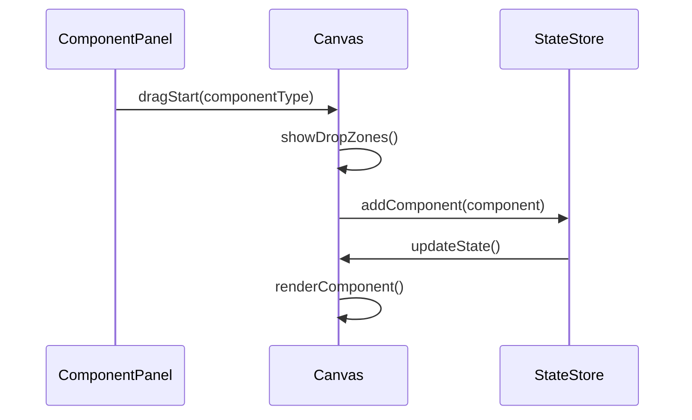

# 开发工作流程

## 概述

本文档描述了 Felix 低代码平台的开发工作流程，包括功能开发、代码审查、测试、部署等各个环节的标准流程和最佳实践。

## 开发流程概览

```mermaid
graph TD
    A[需求分析] --> B[技术设计]
    B --> C[创建分支]
    C --> D[功能开发]
    D --> E[单元测试]
    E --> F[代码审查]
    F --> G[集成测试]
    G --> H[部署测试环境]
    H --> I[用户验收测试]
    I --> J[合并主分支]
    J --> K[部署生产环境]
    K --> L[监控和反馈]
    
    F --> D: 需要修改
    G --> D: 测试失败
    I --> D: 验收失败
```

## 分支管理策略

### Git Flow 工作流

```mermaid
gitgraph
    commit id: "Initial"
    branch develop
    checkout develop
    commit id: "Dev setup"
    
    branch feature/user-auth
    checkout feature/user-auth
    commit id: "Add login"
    commit id: "Add logout"
    
    checkout develop
    merge feature/user-auth
    commit id: "Merge auth"
    
    branch release/v1.0.0
    checkout release/v1.0.0
    commit id: "Prepare release"
    
    checkout main
    merge release/v1.0.0
    commit id: "Release v1.0.0"
    tag: "v1.0.0"
    
    checkout develop
    merge main
```

### 分支命名规范

```bash
# 功能分支
feature/component-drag-drop
feature/data-binding-system
feature/theme-editor

# 修复分支
fix/canvas-rendering-issue
fix/memory-leak-in-hooks
hotfix/critical-security-patch

# 发布分支
release/v1.2.0
release/v2.0.0-beta

# 实验分支
experiment/new-architecture
experiment/performance-optimization
```

## 功能开发流程

### 1. 需求分析

#### 需求文档模板

```markdown
# 功能需求文档

## 功能概述
- **功能名称**: 组件拖拽功能
- **优先级**: 高
- **预估工期**: 5 天
- **负责人**: 张三

## 用户故事
作为一个设计师，我希望能够通过拖拽的方式将组件添加到画布中，以便快速构建页面布局。

## 功能详情
### 基本功能
- [ ] 从组件面板拖拽组件到画布
- [ ] 显示拖拽预览效果
- [ ] 检测有效的放置区域
- [ ] 自动对齐和吸附

### 高级功能
- [ ] 支持组件分组拖拽
- [ ] 拖拽时显示参考线
- [ ] 支持键盘快捷键操作

## 技术要求
- 使用 React DnD 库实现拖拽功能
- 支持触摸设备的拖拽操作
- 性能要求：拖拽延迟 < 16ms

## 验收标准
- [ ] 所有基本功能正常工作
- [ ] 通过所有单元测试
- [ ] 通过用户体验测试
- [ ] 代码覆盖率 > 80%
```

### 2. 技术设计

#### 设计文档模板

```markdown
# 技术设计文档

## 架构设计

### 组件结构
```
DragDropProvider
├── ComponentPanel
│   └── DraggableComponent
└── Canvas
    ├── DropZone
    └── DroppedComponent
```

### 数据流设计


### API 设计
```typescript
interface DragDropAPI {
  onDragStart: (componentType: string) => void;
  onDragOver: (event: DragEvent) => void;
  onDrop: (event: DragEvent, position: Position) => void;
  onDragEnd: () => void;
}
```

## 实现计划
- Day 1: 基础拖拽功能实现
- Day 2: 放置区域检测和预览
- Day 3: 对齐和吸附功能
- Day 4: 测试和优化
- Day 5: 文档和代码审查
```

### 3. 创建开发分支

```bash
# 从 develop 分支创建功能分支
git checkout develop
git pull origin develop
git checkout -b feature/component-drag-drop

# 推送分支到远程
git push -u origin feature/component-drag-drop
```

### 4. 功能开发

#### 开发环境设置

```bash
# 安装依赖
pnpm install

# 启动开发服务器
pnpm dev

# 启动测试监听
pnpm test --watch
```

#### 代码开发规范

```typescript
// 1. 文件结构规范
src/
├── components/
│   ├── DragDrop/
│   │   ├── index.ts
│   │   ├── DragDropProvider.tsx
│   │   ├── DraggableComponent.tsx
│   │   ├── DropZone.tsx
│   │   ├── hooks/
│   │   │   ├── useDragDrop.ts
│   │   │   └── useDropZone.ts
│   │   ├── types.ts
│   │   └── __tests__/
│   │       ├── DragDropProvider.test.tsx
│   │       └── useDragDrop.test.ts
│   └── ...

// 2. 组件开发规范
interface DragDropProviderProps {
  children: React.ReactNode;
  onDrop?: (item: DragItem, position: Position) => void;
}

export const DragDropProvider: React.FC<DragDropProviderProps> = ({
  children,
  onDrop
}) => {
  const [dragState, setDragState] = useState<DragState>({
    isDragging: false,
    dragItem: null,
    dropZones: []
  });

  const handleDragStart = useCallback((item: DragItem) => {
    setDragState(prev => ({
      ...prev,
      isDragging: true,
      dragItem: item
    }));
  }, []);

  // ... 其他逻辑

  return (
    <DragDropContext.Provider value={{ dragState, handleDragStart }}>
      {children}
    </DragDropContext.Provider>
  );
};
```

#### 提交规范

```bash
# 提交消息格式
git commit -m "feat(drag-drop): add basic drag and drop functionality

- Implement DragDropProvider component
- Add useDragDrop hook for state management
- Support dragging components from panel to canvas
- Add visual feedback during drag operation

Closes #123"

# 提交类型
feat: 新功能
fix: 修复 bug
docs: 文档更新
style: 代码格式调整
refactor: 代码重构
test: 测试相关
chore: 构建过程或辅助工具的变动
```

### 5. 测试开发

#### 单元测试

```typescript
// DragDropProvider.test.tsx
import { render, screen, fireEvent } from '@testing-library/react';
import { DragDropProvider } from '../DragDropProvider';
import { DraggableComponent } from '../DraggableComponent';

describe('DragDropProvider', () => {
  it('should handle drag start event', () => {
    const onDrop = jest.fn();
    
    render(
      <DragDropProvider onDrop={onDrop}>
        <DraggableComponent type="button" />
      </DragDropProvider>
    );

    const draggable = screen.getByTestId('draggable-button');
    fireEvent.dragStart(draggable);

    // 验证拖拽状态已更新
    expect(screen.getByTestId('drag-preview')).toBeInTheDocument();
  });

  it('should handle drop event', () => {
    const onDrop = jest.fn();
    
    render(
      <DragDropProvider onDrop={onDrop}>
        <DraggableComponent type="button" />
        <div data-testid="drop-zone" />
      </DragDropProvider>
    );

    const draggable = screen.getByTestId('draggable-button');
    const dropZone = screen.getByTestId('drop-zone');

    fireEvent.dragStart(draggable);
    fireEvent.dragOver(dropZone);
    fireEvent.drop(dropZone);

    expect(onDrop).toHaveBeenCalledWith(
      expect.objectContaining({ type: 'button' }),
      expect.any(Object)
    );
  });
});
```

#### 集成测试

```typescript
// DragDrop.integration.test.tsx
import { render, screen, fireEvent } from '@testing-library/react';
import { LowCodePlatformView } from '@/views/LowCodePlatformView';

describe('Drag Drop Integration', () => {
  it('should add component to canvas when dropped', async () => {
    render(<LowCodePlatformView />);

    const buttonComponent = screen.getByTestId('component-button');
    const canvas = screen.getByTestId('canvas');

    // 模拟拖拽操作
    fireEvent.dragStart(buttonComponent);
    fireEvent.dragOver(canvas);
    fireEvent.drop(canvas);

    // 验证组件已添加到画布
    await waitFor(() => {
      expect(canvas).toContainElement(
        screen.getByTestId('canvas-component-button')
      );
    });
  });
});
```

## 代码审查流程

### 1. 创建 Pull Request

```markdown
# Pull Request 模板

## 功能描述
实现组件拖拽功能，支持从组件面板拖拽组件到画布中。

## 变更内容
- [ ] 新增 DragDropProvider 组件
- [ ] 实现 useDragDrop Hook
- [ ] 添加拖拽预览效果
- [ ] 支持放置区域检测

## 测试情况
- [ ] 单元测试通过 (覆盖率 85%)
- [ ] 集成测试通过
- [ ] 手动测试通过
- [ ] 性能测试通过

## 截图/录屏
[拖拽功能演示视频]

## 检查清单
- [ ] 代码符合规范
- [ ] 添加了必要的测试
- [ ] 更新了相关文档
- [ ] 没有引入破坏性变更

## 相关 Issue
Closes #123
```

### 2. 代码审查标准

#### 审查检查点

```markdown
## 代码质量
- [ ] 代码逻辑清晰，易于理解
- [ ] 变量和函数命名规范
- [ ] 没有重复代码
- [ ] 错误处理完善
- [ ] 性能考虑充分

## 架构设计
- [ ] 符合项目架构规范
- [ ] 组件职责单一
- [ ] 接口设计合理
- [ ] 可扩展性良好

## 测试覆盖
- [ ] 单元测试覆盖率 > 80%
- [ ] 关键路径有集成测试
- [ ] 边界条件有测试覆盖
- [ ] 错误场景有测试覆盖

## 文档完整性
- [ ] 代码注释充分
- [ ] API 文档更新
- [ ] 用户文档更新
- [ ] 变更日志更新
```

### 3. 审查反馈处理

```bash
# 根据审查意见修改代码
git add .
git commit -m "fix: address code review feedback

- Improve error handling in drag drop logic
- Add missing unit tests for edge cases
- Update component documentation"

# 推送更新
git push origin feature/component-drag-drop
```

## 测试流程

### 1. 自动化测试

```yaml
# .github/workflows/test.yml
name: Test Suite

on:
  pull_request:
    branches: [main, develop]
  push:
    branches: [main, develop]

jobs:
  test:
    runs-on: ubuntu-latest
    
    steps:
      - uses: actions/checkout@v3
      
      - name: Setup Node.js
        uses: actions/setup-node@v3
        with:
          node-version: '18'
          cache: 'pnpm'
      
      - name: Install dependencies
        run: pnpm install
      
      - name: Run linting
        run: pnpm lint
      
      - name: Run type checking
        run: pnpm type-check
      
      - name: Run unit tests
        run: pnpm test:coverage
      
      - name: Run integration tests
        run: pnpm test:integration
      
      - name: Run E2E tests
        run: pnpm test:e2e
      
      - name: Upload coverage
        uses: codecov/codecov-action@v3
```

### 2. 手动测试

#### 测试用例模板

```markdown
# 测试用例: 组件拖拽功能

## 测试环境
- 浏览器: Chrome 120+
- 操作系统: macOS/Windows/Linux
- 屏幕分辨率: 1920x1080

## 测试步骤

### 基本拖拽功能
1. 打开低代码平台
2. 从左侧组件面板选择按钮组件
3. 拖拽按钮组件到画布中央
4. 释放鼠标

**预期结果**: 按钮组件成功添加到画布中

### 拖拽预览效果
1. 开始拖拽组件
2. 观察拖拽过程中的视觉反馈

**预期结果**: 显示半透明的组件预览

### 放置区域检测
1. 拖拽组件到无效区域（如工具栏）
2. 观察视觉反馈

**预期结果**: 显示禁止放置的图标

## 测试结果
- [ ] 基本功能正常
- [ ] 预览效果正确
- [ ] 区域检测有效
- [ ] 性能表现良好
```

## 部署流程

### 1. 测试环境部署

```bash
# 自动部署脚本
#!/bin/bash

# 构建项目
pnpm build

# 部署到测试环境
rsync -avz ./dist/ user@test-server:/var/www/test/

# 重启服务
ssh user@test-server "sudo systemctl restart nginx"

# 运行健康检查
curl -f http://test.example.com/health || exit 1

echo "测试环境部署成功"
```

### 2. 生产环境部署

```yaml
# .github/workflows/deploy.yml
name: Deploy to Production

on:
  push:
    tags:
      - 'v*'

jobs:
  deploy:
    runs-on: ubuntu-latest
    
    steps:
      - uses: actions/checkout@v3
      
      - name: Setup Node.js
        uses: actions/setup-node@v3
        with:
          node-version: '18'
          cache: 'pnpm'
      
      - name: Install dependencies
        run: pnpm install
      
      - name: Run tests
        run: pnpm test
      
      - name: Build project
        run: pnpm build
      
      - name: Deploy to production
        run: |
          # 部署逻辑
          echo "Deploying to production..."
      
      - name: Health check
        run: |
          curl -f https://felix.example.com/health
```

## 监控和反馈

### 1. 性能监控

```typescript
// 性能监控配置
import { Analytics } from '@vercel/analytics';

// 监控关键指标
const performanceObserver = new PerformanceObserver((list) => {
  for (const entry of list.getEntries()) {
    if (entry.entryType === 'measure') {
      Analytics.track('performance', {
        name: entry.name,
        duration: entry.duration,
        startTime: entry.startTime
      });
    }
  }
});

performanceObserver.observe({ entryTypes: ['measure'] });

// 监控拖拽性能
export const useDragPerformance = () => {
  const measureDragPerformance = useCallback((action: string) => {
    performance.mark(`drag-${action}-start`);
    
    return () => {
      performance.mark(`drag-${action}-end`);
      performance.measure(
        `drag-${action}`,
        `drag-${action}-start`,
        `drag-${action}-end`
      );
    };
  }, []);

  return { measureDragPerformance };
};
```

### 2. 错误监控

```typescript
// 错误监控配置
import * as Sentry from '@sentry/react';

Sentry.init({
  dsn: process.env.NEXT_PUBLIC_SENTRY_DSN,
  environment: process.env.NODE_ENV,
  tracesSampleRate: 1.0,
});

// 错误边界组件
export const ErrorBoundary: React.FC<{ children: React.ReactNode }> = ({
  children
}) => {
  return (
    <Sentry.ErrorBoundary fallback={ErrorFallback}>
      {children}
    </Sentry.ErrorBoundary>
  );
};
```

### 3. 用户反馈收集

```typescript
// 用户反馈组件
export const FeedbackWidget: React.FC = () => {
  const [feedback, setFeedback] = useState('');
  
  const submitFeedback = async () => {
    await fetch('/api/feedback', {
      method: 'POST',
      headers: { 'Content-Type': 'application/json' },
      body: JSON.stringify({
        feedback,
        url: window.location.href,
        userAgent: navigator.userAgent,
        timestamp: new Date().toISOString()
      })
    });
  };

  return (
    <div className="feedback-widget">
      <textarea
        value={feedback}
        onChange={(e) => setFeedback(e.target.value)}
        placeholder="请提供您的反馈..."
      />
      <button onClick={submitFeedback}>提交反馈</button>
    </div>
  );
};
```

## 发布流程

### 1. 版本发布

```bash
# 版本发布脚本
#!/bin/bash

# 检查当前分支
if [ "$(git branch --show-current)" != "main" ]; then
  echo "请在 main 分支上执行发布"
  exit 1
fi

# 运行测试
pnpm test

# 更新版本号
pnpm version patch  # 或 minor, major

# 生成变更日志
pnpm changelog

# 推送标签
git push origin --tags

# 触发部署
echo "版本发布完成，自动部署已触发"
```

### 2. 发布说明

```markdown
# Felix v1.2.0 发布说明

## 新功能
- ✨ 新增组件拖拽功能
- ✨ 支持组件分组管理
- ✨ 添加主题编辑器

## 改进
- 🚀 提升画布渲染性能 30%
- 🎨 优化用户界面体验
- 📱 改进移动端适配

## 修复
- 🐛 修复内存泄漏问题
- 🐛 修复组件属性编辑器的显示问题
- 🐛 修复数据绑定的同步问题

## 破坏性变更
- ⚠️ 组件 API 中的 `type` 属性重命名为 `variant`
- ⚠️ 移除了已废弃的 `LegacyComponent`

## 升级指南
详见 [升级指南](./UPGRADE.md)

## 贡献者
感谢以下贡献者的努力：
- @contributor1
- @contributor2
- @contributor3
```

## 最佳实践

### 1. 开发效率

- **使用模板**: 为常见任务创建代码模板
- **自动化工具**: 使用脚本自动化重复任务
- **热重载**: 利用开发服务器的热重载功能
- **调试工具**: 熟练使用浏览器开发者工具

### 2. 代码质量

- **代码审查**: 所有代码都要经过审查
- **自动化测试**: 保持高测试覆盖率
- **静态分析**: 使用 ESLint、TypeScript 等工具
- **性能监控**: 持续监控应用性能

### 3. 团队协作

- **文档先行**: 重要功能先写设计文档
- **沟通及时**: 遇到问题及时沟通
- **知识分享**: 定期进行技术分享
- **代码规范**: 遵循统一的代码规范

### 4. 持续改进

- **回顾总结**: 定期进行项目回顾
- **流程优化**: 不断优化开发流程
- **技术升级**: 及时升级技术栈
- **用户反馈**: 重视用户反馈并及时响应

---

通过遵循这套完整的开发工作流程，可以确保 Felix 低代码平台的开发质量和效率，为用户提供稳定、可靠的产品体验。